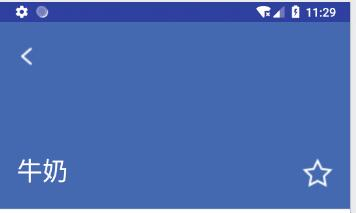
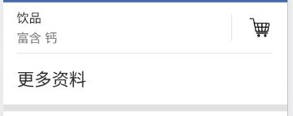

# 中山大学数据科学与计算机学院本科生实验报告

## （2018年秋季学期）

| 课程名称 | 手机平台应用开发 |   任课老师   |       郑贵锋        |
| :------: | :--------------: | :----------: | :-----------------: |
|   年级   |       16级       | 专业（方向） |   计算机应用软件    |
|   学号   |     16340157     |     姓名     |       刘亚辉        |
|   电话   |   15989067460    |    Email     | 15989067460@163.com |
| 开始日期 |     10月14日     |   完成日期   |      10月15日       |

------

## 一、实验题目

**Intent、Bundle**的使用以及**RecyclerView、ListView**的应用

**实验目的**

1. 复习事件处理
2. 学习**Intent、Bundle**在Activity跳转中的应用
3. 学习**RecyclerView、ListView**以及各类适配器的用法
4. 学习**FloatingActionBar**的用法

------

## 二、实验内容

本次实验模拟实现一个健康食品列表，有两个界面，第一个界面用于呈现食品列表 如下所示


数据在"manual/素材"目录下给出。
点击右下方的悬浮按钮可以切换到收藏夹


上面两个列表点击任意一项后，可以看到详细的信息：


**UI要求**

- 食品列表

  每一项为一个圆圈和一个名字，圆圈和名字都是垂直居中。圆圈内的内容是该食品的种类，内容要处于圆圈的中心，颜色为白色。食品名字为黑色，圆圈颜色自定义，只需能看见圆圈内的内容即可。

- 收藏夹

  与食品列表相似。

- 食品详情界面

  - 界面顶部

    

    顶部占整个界面的1/3。每个食品详情的顶部颜色在数据中已给出。返回图标处于这块区域的左上角，食品名字处于左下角，星标处于右下角，边距可以自己设置。 **返回图标与名字左对齐，名字与星标底边对齐。** 建议用RelativeLayout实现，以熟悉RelativeLayout的使用。

  - 界面中部

    

    使用的黑色argb编码值为#D5000000，稍微偏灰色的“富含”“蛋白质”的argb编码值为#8A000000。"更多资料"一栏上方有一条分割线，argb编码值为#1E000000。右边收藏符号的左边也有一条分割线，要求与收藏符号高度一致，垂直居中。字体大小自定。"更多资料"下方分割线高度自定。这部分所有的分割线argb编码值都是#1E000000。

  - 界面底部

    

    使用的黑色argb编码值为#D5000000。

  - 标题栏

    两个界面的标题栏都需要去掉

**功能要求**

- 使用RecyclerView实现食品列表。点击某个食品会跳转到该食品的详情界面，呈现该食品的详细信息。长按列表中某个食品会删除该食品，并弹出Toast，提示 **"删除XX"** 。

- 点击右下方的FloatingActionButton，从食品列表切换到收藏夹或从收藏夹切换到食品列表，并且该按钮的图片作出相应改变。

- 使用ListView实现收藏夹。点击收藏夹的某个食品会跳转到食品详情界面，呈现该食品的详细信息。长按收藏夹中的某个食品会弹出对话框询问是否移出该食品，点击确定则移除该食品，点击取消则对话框消失。如长按“鸡蛋”，对话框内容如下图所示。

  

- 商品详情界面中点击返回图标会返回上一层。点击星标会切换状态，如果原本是空心星星，则会变成实心星星；原本是实心星星，则会变成空心星星。点击收藏图表则将该食品添加到收藏夹并弹出Toast提示 **"已收藏"**

------

## 三、实验过程

### (1)实验截图

- Home界面（食物列表界面）：


- 食物详情界面

  

- 点击星星

  

- 点击收藏

  

- 收藏列表

  

- 删除收藏列表条目

  

  

- 删除主界面列表条目(海鱼、牛奶)

  

### (2)实验步骤以及关键代码

- **界面设计框架（代码结构目录）**

  ```bash
  D:.
  ├─java
  │  └─com
  │      └─example
  │          └─liuyh73
  │              └─healthyfoods
  |					├─ Collection.java	#定义食品模板属性及方法
  |					├─ Detail.java		#食品详情界面		
  |					├─ MainActivity.java #主界面
  |					├─ MyListViewAdapter.java #自定义adapter （用于ListView）
  |					├─ MyRecyclerViewAdapter.java #自定义adapter（用于RecyclerView）
  |					├─ MyViewHolder.java	#自定义ViewHolder （用于RecyclerViewAdapter）
  |					└─ OnitemClickListener.interface # 定义监听接口（用于RecyclerViewAdapter）
  └─res
      ├─drawable
      |	├─ abbr.xml					# 定义食品简称样式文件
      |	├─ border_bottom.xml		# 底边线样式（窄）
      |	├─ border_bottom_wide.xml	# 底边线样式（宽）
      |	└─ border_left.xml			# 左边线样式
      ├─layout
      |	├─ activity_main.xml		# 主界面
      |	├─ detial.xml				# 详情界面
      |	├─ item.xml					# 列表组件样式
      |	└─ operation.xml			# 操作样式
      └─values
      	└─ colors.xml				# 颜色定义文件				
  ```

- **数据结构Collection**

  由于传递食品的时候，需要将这个类序列化后放在bundle里，然后再将这个bundle放在intent中，所以需要实现Seriablizable接口。

  ```java
  public class Collection implements Serializable {
      private String Name;
      private String Abbr;
      private String Category;
      private String Nutritive;
      private String BgColor;
      private boolean isCollected;
      public Collection(String Name, String Abbr, String Category, String Nutritive, String BgColor) {
          this.Name = Name;
          this.Abbr = Abbr;
          this.Category = Category;
          this.Nutritive = Nutritive;
          this.BgColor = BgColor;
          this.isCollected = false;
      }
      public String getName() {
          return this.Name;
      }
      public String getAbbr() {
          return this.Abbr;
      }
      public String getCategory() {
          return this.Category;
      }
      public String getNutritive() {
          return this.Nutritive;
      }
      public String getBgColor() {
          return this.BgColor;
      }
      public boolean getIsCollected() {return this.isCollected;}
      public void setIsCollected(boolean isCollected){
          this.isCollected = isCollected;
      }
  }
  ```

- **Home主界面**

  **activity_main.xml样式文件定义：**

  ```xml
      <!-- 以下是主要的组件 -->
  	<!-- 主界面列表控件RecycleView -->
      <android.support.v7.widget.RecyclerView
          android:id="@+id/recyclerView"
          android:layout_height="wrap_content"
          android:layout_width="match_parent"
          />
  	<!-- 收藏夹列表控件ListView -->
      <ListView
          android:id="@+id/listView"
          android:layout_width="match_parent"
          android:layout_height="wrap_content"/>
  	<!-- 悬浮按钮 -->
      <android.support.design.widget.FloatingActionButton
          android:id="@+id/collectBtn"
          android:layout_width="wrap_content"
          android:layout_height="wrap_content"
          android:src="@mipmap/collections"
          android:backgroundTint="@color/colorWhite"
          android:backgroundTintMode="src_atop"
          app:layout_constraintBottom_toBottomOf="parent"
          app:layout_constraintRight_toRightOf="parent"
          android:layout_margin="25dp"/>
  ```

  **MainActivity.java逻辑函数如下**

  主要有两个组件**RecyclerView**和**ListView**：

  - 使用**RecyclerView**需要为组件设置适配器adapter、LayoutManager和Animation等。适配器用于填充数据，LayoutManager用于显示布局格式，Animation可以来设置动画具体设置如下：

  ```java
  // 初始化recyclerView
  recyclerView = findViewById(R.id.recyclerView);
  // 初始化MyRecyclerViewAdapter
  recyclerViewAdapter = new MyRecyclerViewAdapter<Collection>(MainActivity.this, R.layout.item, this.foodList) {
      @Override
      public void convert(MyViewHolder holder, Collection s) {
          // Colloction是自定义的一个类，封装了食物信息
          TextView name = holder.getView(R.id.name);
          name.setText(s.getName());
          TextView abbr = holder.getView(R.id.abbr);
          abbr.setText(s.getAbbr());
      }
  };
  // 设置LayoutManager
  LinearLayoutManager layoutManager = new LinearLayoutManager(this);
  layoutManager.setOrientation(LinearLayoutManager.VERTICAL);
  recyclerView.setLayoutManager(layoutManager);
  // 设置Animation
  ScaleInAnimationAdapter scaleInAnimationAdapter = new ScaleInAnimationAdapter(recyclerViewAdapter);
  scaleInAnimationAdapter.setDuration(1000);
  recyclerView.setAdapter(scaleInAnimationAdapter);
  recyclerView.setItemAnimator(new OvershootInLeftAnimator());
  ```

  **MyRecyclerViewAdapter**为自定义的适配器，需要实现**onCreateViewHolder**和**onBindViewHolder**等函数：**ViewHolder**用于将数据与相应的layout进行绑定（**ViewHolder**在后续过程中实现）。

  ```java
  /**
   * 根据不同ViewType创建与之相应的Item-Layout
   */
  @Override
  public MyViewHolder onCreateViewHolder(ViewGroup parent, int viewType) {
      MyViewHolder holder = MyViewHolder.get(this.context, parent, this.layoutId);
      return holder;
  }
  
  /**
   * 访问数据集合并将数据绑定到正确的View上。
   */
  @Override
  public void onBindViewHolder(final MyViewHolder holder, int position) {
      convert(holder, this.foodList.get(position));
  
      if(onItemClickListener != null) {
          holder.itemView.setOnClickListener((new View.OnClickListener(){
              @Override
              public void onClick(View view) {
                  onItemClickListener.onClick(holder.getAdapterPosition());
              }
          }));
  
          holder.itemView.setOnLongClickListener((new View.OnLongClickListener(){
              @Override
              public boolean onLongClick(View view) {
                  onItemClickListener.onLongClick(holder.getAdapterPosition());
                  return true;
              }
          }));
      }
  }
  ```

  上述代码中定义的**onItemClickListener**为适配器的一个点击监听属性，用于处理点击事件，具体实现如下：

  首先，我定义了**OnItemClickListener**接口：

  ```java
  public interface OnItemClickListener{
      void onClick(int position);
      void onLongClick(int position);
  }
  ```

  然后，在**MainActivity.java**文件中，定义食品点击监听事件，利用匿名内部类的方式实现了**OnItemClickListener**接口，并定义一个匿名对象作为函数**setOnItemClickListener**的参数：

  ```java
  // 设定食品点击监听事件
  recyclerViewAdapter.setOnItemClickListener(new OnItemClickListener() {
      @Override
      // 将所选食品条目传递给Detail界面
      public void onClick(int position) {
          Collection food = foodList.get(position);
          Intent intent = new Intent(MainActivity.this, Detail.class);
          intent.putExtra("Current food", food);
          startActivityForResult(intent, REQUEST_CODE);
      }
  	// 删除所选中的条目
      @Override
      public void onLongClick(int position) {
          Collection food = foodList.get(position);
          foodList.remove(position);
          recyclerViewAdapter.notifyItemRemoved(position);
          Toast.makeText(MainActivity.this, "删除"+food.getName(), Toast.LENGTH_SHORT).show();
      }
  });
  ```

  适配器内部**setOnItemClickListener**定义如下：

  ```java
  public void setOnItemClickListener(OnItemClickListener _onItemClickListener) {
      this.onItemClickListener = _onItemClickListener;
  }
  ```

  之后，就可以调用**onItemClickListener**对象来处理点击事件。

  另一方面，在**onBindViewHolder**函数中，调用了一个函数**convert(holder, this.foodList.get(position));**

  ```java
  public abstract void convert(MyViewHolder holder, Collection t);
  ```

  在定义**MyRecyclerViewAdapter**对象时需要重载上述抽象函数：主要利用**ViewHolder**将布局与数据进行绑定。

  ```java
  // 初始化MyRecyclerViewAdapter
  recyclerViewAdapter = new MyRecyclerViewAdapter<Collection>(MainActivity.this, R.layout.item, this.foodList) {
      @Override
      public void convert(MyViewHolder holder, Collection s) {
          // Colloction是自定义的一个类，封装了数据信息
          TextView name = holder.getView(R.id.name);
          name.setText(s.getName());
          TextView abbr = holder.getView(R.id.abbr);
          abbr.setText(s.getAbbr());
      }
  };
  ```

  之前已经多次使用了**ViewHolder**，下面将进行**ViewHolder**的实现：

  ```java
  /**
   * ViewHolder通常出现在适配器中，为的是listview，recyclerview滚动时快速设置值，
   * 而不必每次都重新创建很多对象，从而提升性能。
   */
  public class MyViewHolder extends RecyclerView.ViewHolder {
      /**
       * views 存储listitem中的子View
       */
      private SparseArray<View> views;
      private View view;
  
      public MyViewHolder(Context _context, View _view, ViewGroup _viewGroup){
          super(_view);
          view = _view;
          views = new SparseArray<View>();
      }
  
      /**
       *  获取MyViewHolder实例
       */
      public static MyViewHolder get(Context _context, ViewGroup _viewGroup, int _layoutId) {
          View _view = LayoutInflater.from(_context).inflate(_layoutId, _viewGroup, false);
          MyViewHolder holder = new MyViewHolder(_context, _view, _viewGroup);
          return holder;
      }
  
      /**
       * ViewHolder尚未将子View缓存到SparseArray数组中时，仍然需要通过
       * findViewById()创建View对象，如果已缓存，直接返回即可。
       */
      public <T extends View> T getView(int _viewId) {
          View _view = views.get(_viewId);
          if (_view == null) {
              // 创建view
              _view = view.findViewById(_viewId);
              // 将view存入views
              views.put(_viewId, _view);
          }
          return (T)_view;
      }
  }
  ```

  - 使用**ListView**也是如此，需要设置适配器adapter等：

  ```java
  // 初始化listView
  listView = findViewById(R.id.listView);
  // 初始化listViewAdapter
  listViewAdapter = new MyListViewAdapter(collectList, MainActivity.this);
  // 设置 listViewAdapter
  listView.setAdapter(listViewAdapter);
  ```

  自定义适配器实现如下：

  ```java
  // 主要有四个函数getCount(), getItemId(int), getItem(i), getView(int, View, ViewGroup)
  // 主要介绍一下getView
  @Override
  public View getView(int i, View view, ViewGroup viewGroup) {
      // 新声明一个View变量和ViewHoleder变量,ViewHolder类在下面定义。
      View convertView;
      ViewHolder viewHolder;
      // 当view为空时才加载布局，否则，直接修改内容
      if (view == null) {
          // 通过inflate的方法加载布局，context需要在使用这个Adapter的Activity中传入。
          convertView = LayoutInflater.from(context).inflate(R.layout.item, null);
          viewHolder = new ViewHolder();
          viewHolder.name = convertView.findViewById(R.id.name);
          viewHolder.abbr = convertView.findViewById(R.id.abbr);
          convertView.setTag(viewHolder); // 用setTag方法将处理好的viewHolder放入view中
      } else { // 否则，让convertView等于view，然后从中取出ViewHolder即可
          convertView = view;
          viewHolder = (ViewHolder) convertView.getTag();
      }
      // 从viewHolder中取出对应的对象，然后赋值给他们
      viewHolder.name.setText(foodList.get(i).getName());
      viewHolder.abbr.setText(foodList.get(i).getAbbr());
      // 将这个处理好的view返回
      return convertView;
  }
  ```

  - 主要点击事件逻辑处理函数如下：

  食品点击事件上面已经有所展示，不再赘述。

  购物栏点击事件：（在该点击事件中，主要处理recyclerView和listView的交互显示以及购物栏图标的转换，初始时list View不显示，recyclerView显示）

  ```java
  // 设置购物栏点击事件
  collectBtn = findViewById(R.id.collectBtn);
  collectBtn.setOnClickListener(new View.OnClickListener() {
      @Override
      public void onClick(View v) {
          if(recyclerView.getVisibility() == View.VISIBLE) {
              recyclerView.setVisibility(View.INVISIBLE);
              listView.setVisibility(View.VISIBLE);
              collectBtn.setImageResource(R.mipmap.mainpage);
          } else {
              recyclerView.setVisibility(View.VISIBLE);
              listView.setVisibility(View.INVISIBLE);
              collectBtn.setImageResource(R.mipmap.collections);
          }
      }
  });
  
  ```

  收藏夹列表项点击事件：（将点击的食物条目传递给Detail界面）

  ```java
  // 设置收藏夹列表项点击事件
  listView.setOnItemClickListener(new AdapterView.OnItemClickListener() {
      @Override
      public void onItemClick(AdapterView<?> parent, View view, int position, long id) {
          if(position == 0) return;
          Collection food = collectList.get(position);
          Intent intent = new Intent(MainActivity.this, Detail.class);
          intent.putExtra("Current food", food);
          startActivityForResult(intent, REQUEST_CODE);
      }
  });
  ```

  收藏夹列表项长点击事件：（弹出Dialog提示删除信息，确认后删除所点击的条目）

  ```java
  // 设置收藏夹列表项长点击事件
  listView.setOnItemLongClickListener(new AdapterView.OnItemLongClickListener() {
      @Override
      public boolean onItemLongClick(AdapterView<?> parent, View view, final int position, long id) {
          if(position == 0) return false;
          final Collection food = collectList.get(position);
          final AlertDialog.Builder alertDialog = new AlertDialog.Builder(MainActivity.this);
          alertDialog.setIcon(R.mipmap.ic_launcher).setTitle("删除").setMessage("确定删除"+food.getName()).setPositiveButton("确定", new DialogInterface.OnClickListener() {
              @Override
              public void onClick(DialogInterface dialog, int which) {
                  collectList.remove(food);
                  for(int i=0;i<foodList.size();i++){
                      if(food.equals(foodList.get(i))){
                          food.setIsCollected(false);
                          foodList.set(i, food);
                          break;
                      }
                  }
                  listViewAdapter.refresh(collectList);
              }
          }).setNegativeButton("取消", new DialogInterface.OnClickListener() {
              @Override
              public void onClick(DialogInterface dialog, int which) {
              }
          });
          alertDialog.show();
          return true;
      }
  });
  ```

  在传递给Detail数据之后，如何处理Detail传递回来的数据？

  ```java
  // 重载onActivityResult函数，其中requestCode表示跳转到Detail界面所用的REQUEST_CODE，resultCode表示Detail界面返到MainActivity界面的REQUEST_CODE.
  @Override
  public void onActivityResult(int requestCode, int resultCode, Intent intent) {
      super.onActivityResult(requestCode, resultCode, intent);
      if(requestCode == REQUEST_CODE) {
          if (resultCode == 2) {
              Bundle extras = intent.getExtras();
              Collection food = (Collection) extras.get("Collecting food");
              collectList.add(food);
              listViewAdapter.refresh(collectList);
          }
      }
  }
  ```

- **Detail详情界面**

  - Detail界面布局

    主要分为三个位置：顶部、中部和底部

    其中顶部占总显示屏高度的1/3：我们可以采用**LinearLayout**所特有的**layout_weight**属性来实现：

    ```xml
    <LinearLayout
        android:layout_width="match_parent"
        android:layout_height="match_parent"
        android:orientation="vertical">
    	<RelativeLayout
            android:id="@+id/top"
            android:layout_weight="6"
            android:layout_width="match_parent"
        	android:layout_height="match_parent">
            <!-- 其他内容 -->
        </RelativeLayout>
        <RelativeLayout
            android:id="@+id/mid"
            android:layout_weight="7"
            android:layout_width="match_parent"
        	android:layout_height="match_parent">
            <!-- 其他内容 -->
        </RelativeLayout>
        <ListView
            android:id="@+id/listView"
            android:layout_weight="5"
            android:layout_width="match_parent"
        	android:layout_height="match_parent">
            <!-- 其他内容 -->
        </ListView>
    </LinearLayout>
    ```

    关于权重的设定如下：我的做法是top占1/3，mid占2/9，listView占4/9（即mid和listView占比为1:2）。

    下面具体介绍权重的计算公式，layout_weight表示的是该控件占屏幕剩余空间的权重。由于我设定每个组件的layout_height都等于match_parent，即每个组件初始高度都应该与父组件等高，即为L。所以三各控件总初始高度为3L，则剩余屏幕空间高度为-2L。我们可以设top，mid和listView的权重分别为x，y，z。则三个组件的实际高度分别为：

    $L+(-2L)*x/(x+y+z)=(1/3)L$

    $L+(-2L)*y/(x+y+z)=(2/9)L$

    $L+(-2L)*z/(x+y+z)=(4/9)L$

    解上述三个方程，即可得到三者权重分别为6，7，5。

    另一种方法便是将每个组件layout_height都设置为0，然后利用相同的方法计算权重即可。

  - Detail界面处理函数

    Detail界面中首先需要处理的即为从MainActivity传递而来的数据：获取Collection对象，并对组件中的每一项进行相应的赋值。

  ```java
  private void fillFoodInfo() {
      Bundle extras = getIntent().getExtras();
      food = (Collection) extras.get("Current food");
      TextView foodName = findViewById(R.id.foodName);
      TextView category = findViewById(R.id.category);
      TextView nutritive = findViewById(R.id.nutritive);
      RelativeLayout top = findViewById(R.id.top);
      foodName.setText(food.getName());
      category.setText(food.getCategory());
      nutritive.setText(food.getNutritive());
      top.setBackgroundColor(Color.parseColor(food.getBgColor()));
  }
  ```

  listView的绑定适配器：（ArrayAdapter）

  ```java
  ArrayAdapter<String>operationListViewAdapter = new ArrayAdapter<>(this, R.layout.operation, operations);
  operationListView.setAdapter(operationListViewAdapter);
  ```

  operation布局文件实现如下：（为一个简单的TextView，显示相应的数据即可）

  ```xml
  <?xml version="1.0" encoding="utf-8"?>
  <TextView xmlns:android="http://schemas.android.com/apk/res/android"
      android:layout_width="wrap_content"
      android:layout_height="wrap_content"
      android:paddingTop="10dp"
      android:paddingBottom="10dp"
      android:textSize="25sp"
      android:textColor="@color/colorBlack"
      android:gravity="center_vertical"/>
  ```

  之后主要是事件处理函数：

  star星星：利用setTag()和getTag()来标识行星的状态。

  ```java
  star.setOnClickListener(new View.OnClickListener() {
      @Override
      public void onClick(View v) {
          if((int)star.getTag() == 0) {
              star.setImageResource(R.mipmap.full_star);
              star.setTag(1);
          } else {
              star.setImageResource(R.mipmap.empty_star);
              star.setTag(0);
          }
      }
  });
  ```

  back回退键：如果该食品被收藏，则给主界面传递该食品，主界面进行处理。

  ```java
  back.setOnClickListener(new View.OnClickListener() {
      @Override
      public void onClick(View v) {
          if(!alreadyCollected) {
              if(food.getIsCollected()) {
                  Intent intent = new Intent();
                  intent.putExtra("Collecting food", food);
                  setResult(REQUEST_CODE, intent);
              }
          }
          finish();
      }
  });
  ```

  收藏按钮点击：

  ```java
  detailCollectBtn.setOnClickListener(new View.OnClickListener() {
      boolean firstClick = true;
      @Override
      public void onClick(View v) {
          if(firstClick) {
              if(food.getIsCollected()){
                  alreadyCollected = true;
              }else {
                  alreadyCollected = false;
                  food.setIsCollected(true);
              }
              Toast.makeText(Detail.this, "已收藏", Toast.LENGTH_SHORT).show();
              firstClick = false;
          }
      }
  });
  ```

- 主界面食物列表和收藏列表的刷新

  **RecyclerView数据项更新：**由于点击事件实际上是在Adapter中处理的，可以直接在Adapter的**onBindViewHolder**方法中直接处理更新问题。之前在绑定点击事件处理时`holder.getAdapterPosition()`这一项实际上是得到被点击的那一项的位置，因此可以直接从data项中删除它，然后调用`notifyItemRemoved(holder.getAdapterPosition())`。即可以在主界面注册**recyclerViewApater**的监听函数中处理更新问题：

  ```java
  // 设定食品点击监听事件
  recyclerViewAdapter.setOnItemClickListener(new OnItemClickListener() {
  	// 省略点击处理函数
      @Override
      public void onLongClick(int position) {
          Collection food = foodList.get(position);
          foodList.remove(position);
          recyclerViewAdapter.notifyItemRemoved(position);
          Toast.makeText(MainActivity.this, "删除"+food.getName(), Toast.LENGTH_SHORT).show();
      }
  });
  ```

  **ListView数据项更新：**

  可以在Activity中修改原list(即调用remove方法)，然后再次传入adapter的一个方法中，比如自定义一个refresh方法，然后在这个方法中对adapter中的list进行重赋值，然后调用notifyDataSetChanged()方法。

  ```java
  // MyListViewAdapter.java
  public void refresh(List<Collection>collectList){
      this.foodList = collectList;
      this.notifyDataSetChanged();
  }
  
  ```


### (3)实验遇到的困难以及解决思路

- Detail界面中边线的实现：

  在drawable文件中自定义border_bottom.xml等文件，来实现边线效果

  ```xml
  <layer-list xmlns:android="http://schemas.android.com/apk/res/android">
      <!-- 连框颜色值 -->
      <item>
          <shape>
              <solid android:color="@color/colorGray" />
          </shape>
      </item>
      <!-- 主体背景颜色值 -->
      <item android:bottom="1.5dp"><!--设置只有底部有边框-->
          <shape>
              <solid android:color="@color/colorWhite" />
          </shape>
      </item>
  </layer-list>
  ```

  在该文件中，实际定义了背景色为colorGray的矩形，然后有定义了背景色为colorWhite的矩形，覆盖掉距离底边1.5dp的区域，显示效果即为边框效果。然后给利用组件的background属性即可实现：

  ```xml
  <RelativeLayout
  	android:id="@+id/midTop"
  	android:layout_width="match_parent"
  	android:layout_height="wrap_content"
  	android:background="@drawable/border_bottom"
  	android:paddingBottom="10dp">
      <!-- 省略其他内容 -->
  </RelativeLayout>
  ```

- Item组件在RecyclerView和ListView显示效果不一致：

  之前item组件实现如下：（省略了组件属性）

  ```xml
  <?xml version="1.0" encoding="utf-8"?>
  <RelativeLayout xmlns:android="http://schemas.android.com/apk/res/android"
      android:id="@+id/item"
      android:layout_width="match_parent"
      android:layout_height="wrap_content"
      android:layout_margin="20dp">
      <TextView
          android:id="@+id/abbr"/>
      <TextView
          android:id="@+id/name"/>
  </RelativeLayout>
  ```

  ListView显示效果如下：（margin并没有效果）

  

  修改Item如下：

  ```xml
  <?xml version="1.0" encoding="utf-8"?>
  <RelativeLayout xmlns:android="http://schemas.android.com/apk/res/android"
      android:id="@+id/item"
      android:layout_width="match_parent"
      android:layout_height="wrap_content">
      <TextView
          android:id="@+id/abbr"
          android:layout_marginLeft="15dp"
          android:layout_marginTop="25dp"/>
      <TextView
          android:id="@+id/name"
          android:layout_marginLeft="15dp"
          android:layout_marginTop="25dp"/>
  
  </RelativeLayout>
  ```

  ListView显示效果如下：

  

- setOnLongClickListener中return的值：

  return的值决定是否在长按后再加一个短按动作，true为不加短按，false为加入短按。

  在代码实现的过程中，如果在recyclerView中的长按事件处理函数`return false;`，则可能会造成程序异常退出。因为长按结束之后，该条目已经删除，而后续的短按事件需要访问该条目，则就会出现异常，使得程序异常退出。

------

## 四、实验思考及感想

在这次实验中，我学习到了activity组件之间的跳转以及利用intent进行传递消息。UWP中我们是利用Navigate来跳转到指定界面，并可以指定第二个参数来传递数据；在Android开发中，我们可以利用startActivityForResult方法来跳转到指定界面，第一个参数intent便是核心，其中包括了跳转界面信息，以及两个界面之间传递的信息，除此之外，Android开发中还有setResult方法，使得跳转后的界面向源界面传递处理后的结果信息，这使得控件之间的信息传递更加完善灵活。通过这次学习，我们更应该学会融会贯通，与之前学习过的内容包括UWP以及Cocos进行相应的比较来提高自身的认识。

除此之外，这次学习我们也学习到了适配器的应用，将数据与布局进行相应的绑定，这与UWP中的数据模板也有相应的联系，两者都是为了解决数据较多且数目不定、布局一致的问题，避免了手动书写多个组件的繁琐，使得界面更加易于管理，代码实现更加简单。

每次实验中，我们都会有相应的收获，我们应该认真完成每一次实验，并且不断思考，提高自身的能力。

------

