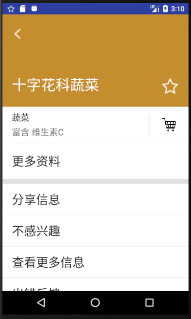
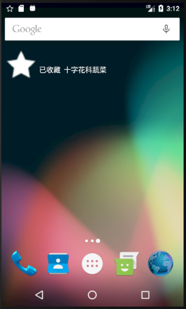
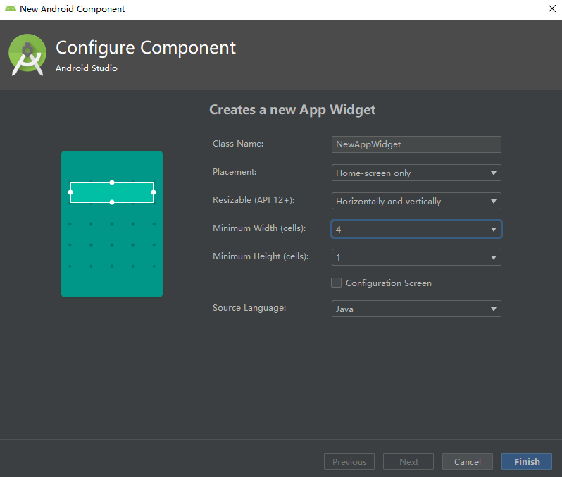

# 中山大学数据科学与计算机学院本科生实验报告
## （2018年秋季学期）
| 课程名称 | 手机平台应用开发 | 任课老师 | 郑贵锋 |
| :------------: | :-------------: | :------------: | :-------------: |
| 年级 | 16级 | 专业（方向） | 计算机应用软件 |
| 学号 | 16340157 | 姓名 | 刘亚辉 |
| 电话 | 15989067460 | Email | 15989067460@163.com |
| 开始日期 | 10月20日 | 完成日期 |10月20日|

---

# Broadcast使用

## 一、实验目的

1. 掌握 Broadcast 编程基础。
2. 掌握动态注册 Broadcast 和静态注册 Broadcast。
3. 掌握 Notification 编程基础。
4. 掌握 EventBus 编程基础。

---

## 二、实现内容

### 实验内容

在第六周任务的基础上，实现静态广播、动态广播两种改变Notification 内容的方法。  

**要求**  

- 在启动应用时，会有通知产生，随机推荐一个食品。  
  
- 点击通知跳转到所推荐食品的详情界面。  
   
- 点击收藏图标，会有对应通知产生，并通过Eventbus在收藏列表更新数据。  
   
- 点击通知返回收藏列表。  
   
- 实现方式要求:启动页面的通知由静态广播产生，点击收藏图标的通知由动态广播产生。   

 

------

### 验收内容

- 静态广播：启动应用是否有随机推荐食品的通知产生。点击通知是否正确跳转到所推荐食品的详情界面。
- 动态广播：点击收藏后是否有提示食品已加入收藏列表的通知产生。同时注意设置launchMode。点击通知是否跳转到收藏列表。
- Eventbus:点击收藏列表图标是否正确添加食品到收藏列表。每点击一次,添加对应的一个食品到收藏列表并产生一条通知。

---

## 三、实验过程
### (1)实验截图

- 启动应用，产生一个推荐食品（十字花科蔬菜）

  

- 点击该通知，进入“十字花科蔬菜”详情界面

  

- 点击收藏按钮，生成“已收藏”的通知

  

- 点击该“已收藏”通知，进入到收藏界面

  

### (2)实验步骤以及关键代码

### 静态广播部分


#### 1. StaticReceiver 

在静态广播类StaticReceiver 中重写onReceive 方法，当接收到对应广播时进行数据处理，产生通知。

```java
public class StaticReceiver extends BroadcastReceiver {
    // 定义静态广播的名称
    private static final String STATICACTION = "com.example.liuyh73.healthyfoods.MyStaticFilter";
    // 在onReceive中，处理静态广播，并可以进行界面跳转
    @Override
    public void onReceive(Context context, Intent intent) {
        if (intent.getAction().equals(STATICACTION)) {
            /*
             * Notification 可以提供持久地通知，位于手机最上层的状态通知栏中
             * 开启Notification主要涉及以下3个类：
             * 1. Notification.Builder：用于动态设置Notification的一些属性
             * 2. NotificationManager：负责将Notification在状态栏显示出来或取消
             * 3. Notification：设置Notification的相关属性
             */
            Bundle extras = intent.getExtras();
            Collection food = (Collection) extras.get("Food notified");
            int icon = (int) extras.get("Icon");
            // 获取状态通知栏管理器
            NotificationManager notificationManager = (NotificationManager)context.getSystemService(Context.NOTIFICATION_SERVICE);
            // 实例化通知栏构造器 Notification.Builder
            Notification.Builder notificationBuilder = new Notification.Builder(context);
            // 对builder进行配置
            notificationBuilder.setContentTitle("今日推荐")  //设置通知栏标题：发件人
                                .setContentText(food.getName()) //设置通知栏显示的内容
                                .setTicker("您有一条新通知")    //通知首次出现在通知栏上，带上升动画效果
                                .setPriority(Notification.PRIORITY_DEFAULT)   //设置通知优先级
                                .setWhen(System.currentTimeMillis())    // 设置通知产生的时间，一般为系统获取的事件
                                .setSmallIcon(icon)      // 设置icon
                                .setAutoCancel(true);                  // 设置这个标志当用户点机面板就可以将通知取消
            // 绑定intent，点击图标能够进入某个activity
            Intent intent1 = new Intent(context, Detail.class);
            intent1.putExtras(extras);
            PendingIntent pendingIntent = PendingIntent.getActivity(context, 0, intent1,PendingIntent.FLAG_UPDATE_CURRENT);
            notificationBuilder.setContentIntent(pendingIntent);

            // 绑定Notification， 发送通知请求
            Notification notification = notificationBuilder.build();
            notificationManager.notify(0, notification);
        }
    }
}

```

**PendingIntent介绍**

pendingIntent是一种特殊的Intent。主要的区别在于Intent的执行是立刻的，而pendingIntent的执行不是立刻的（需要某种条件的触发）。

- `getActivity(Context context, int requestCode, Intent intent, int flags) `方法从系统取得一个用于启动一个Activity的PendingIntent对象。 
- `getService(Context context, int requestCode, Intent intent, int flags)`方法从系统取得一个用于启动一个Service的PendingIntent对象。
- `getBroadcast(Context context, int requestCode, Intent intent, int flags) `方法从系统取得一个用于向BroadcastReceiver的Intent广播的PendingIntent对象

flags的取值有四个： 

1. **FLAG_ONE_SHOT：**获取的PendingIntent只能使用一次。 
2. **FLAG_NO_CREATE：**利用FLAG_NO_CREAT获取的PendingIntent，若描 述的Intent不存在则返回NULL值。 
3. **FLAG_CANCEL_CURRENT：**如果描述的PendingIntent已经存在，则在产生新的Intent之前会先取消掉当前的。 
4. **FLAG_UPDATE_CURRENT：**能够新new一个 Intent。

#### 2. 注册

```xml
<receiver android:name=".StaticReceiver">
    <intent-filter>
        <action android:name="com.example.liuyh73.healthyfoods.MyStaticFilter" />
    </intent-filter>
</receiver>
```

其中action的name属性值与StaticReceiver类中STATICACTION值相同，表示过滤该名称的广播交给StaticReceiver处理。

#### 3. 发送广播

```java
// 产生随机数，随机进行今日推荐
Random random = new Random();
int index = random.nextInt(foodList.size());
// 定义intent，并传递参数
Intent intentBroadCast = new Intent(STATICACTION);
Bundle bundles = new Bundle();
bundles.putSerializable("Food notified", foodList.get(index));
bundles.putSerializable("Icon", R.mipmap.empty_star);
intentBroadCast.putExtras(bundles);
// 发送静态广播
sendBroadcast(intentBroadCast);
```

### 动态广播部分


#### 1. DynamicReceiver

```java
public class DynamicReceiver extends BroadcastReceiver {
    private static final String DYNAMICACTION = "com.example.liuyh73.healthyfoods.MyDynamicFilter";
    private static int count=1;
    @Override
    public void onReceive(Context context, Intent intent) {
        if(intent.getAction().equals(DYNAMICACTION)){
            Bundle extras = intent.getExtras();
            Collection food = (Collection) extras.get("Collecting food");
            int icon = (int) extras.get("Icon");
            // 获取状态通知栏管理器
            NotificationManager notificationManager = (NotificationManager)context.getSystemService(Context.NOTIFICATION_SERVICE);
            // 实例化通知栏构造器 Notification.Builder
            Notification.Builder notificationBuilder = new Notification.Builder(context);
            // 对builder进行配置
            notificationBuilder.setContentTitle("已收藏")  //设置通知栏标题：发件人
                    .setContentText(food.getName()) //设置通知栏显示的内容
                    .setTicker("您有一条新通知")    //通知首次出现在通知栏上，带上升动画效果
                    .setPriority(Notification.PRIORITY_DEFAULT)   //设置通知优先级
                    .setWhen(System.currentTimeMillis())    // 设置通知产生的时间，一般为系统获取的事件
                    .setSmallIcon(icon)      // 设置icon
                    .setAutoCancel(true);                  // 设置这个标志当用户点机面板就可以将通知取消

            // 绑定intent，点击图标能够进入某个activity
            Intent intent1 = new Intent(context, MainActivity.class);
            intent1.putExtra("Collections", "true");
            PendingIntent pendingIntent = PendingIntent.getActivity(context, 0, intent1,PendingIntent.FLAG_CANCEL_CURRENT);
            notificationBuilder.setContentIntent(pendingIntent);

            // 绑定Notification， 发送通知请求
            Notification notification = notificationBuilder.build();
            notificationManager.notify(count++, notification);
        }
    }
}

```

定义基本上与StaticReceiver一致，值得注意的是，我们可以使用`notificationManager.notify(count++, notification);`利用count变量，进行累加生成通知；如果id保持不变，则后续生成的通知会替换掉之前的通知。

#### 2. Detail界面注册、发送、注销动态广播

**注册动态广播**（与AndroidManifest.xml文件中注册功能一致）

```java
// Detail
// 获取intent过滤器
IntentFilter dynamicFilter = new IntentFilter();
// 添加动态广播的Action
dynamicFilter.addAction(DYNAMICACTION); 
DynamicReceiver dynamicReceiver = new DynamicReceiver();
// 注册动态广播
registerReceiver(dynamicReceiver, dynamicFilter);
```

**发送动态广播**

```java
// Detail
// 获取intent并且传递参数
Intent intentBroadcast = new Intent();
intentBroadcast.setAction(DYNAMICACTION);
Bundle bundles = new Bundle();
bundles.putSerializable("Collecting food", food);
bundles.putSerializable("Icon", R.mipmap.empty_star);
intentBroadcast.putExtras(bundles);
// 发送广播
sendBroadcast(intentBroadcast);
```

**注销动态广播**

```java
// Detail
@Override
protected void onDestroy() {
    super.onDestroy();
    // 注销dynamicReceiver
    unregisterReceiver(dynamicReceiver);
}
```

#### 3. 修改主界面launchMode

```xml
<activity
    android:name=".MainActivity"
    android:launchMode = "singleInstance">
    <intent-filter>
        <action android:name="android.intent.action.MAIN" />
        <category android:name="android.intent.category.LAUNCHER" />
    </intent-filter>
</activity>
```

**singleInstance**表示主界面只有一个（单利），不会产生多个备份，该模式使得我们不会产生多个食物列表，便于管理。

### EventBus的使用

[EventBus](https://github.com/greenrobot/EventBus)是一个使用发布者/订阅者模式 并且低耦合的Android开源库。 EventBus只需几行代码即可实现中央通信解耦类：简化代码，删除依赖关系，加快应用程序开发速度。


在我们的应用中，EventBus应用如下：


#### 1. 添加依赖

File -> Project Structure -> app -> Dependancies -> "+" -> Library dependency

```bash
# 添加库依赖
org.greenrobot:eventbus:3.1.1
```

#### 2.定义事件类（传递食品信息）

```java
// 在该事件类中，我只存储了Collection（食品类）的名字字段；也可存储整个Collection对象
public class MessageEvent {
    private String Name;
    public MessageEvent(String Name){
        this.Name = Name;
    }
    public String getName() {
        return this.Name;
    }
}
```

#### 3. 准备订阅者

- 注册订阅者(注册收藏列表所在Activity为订阅者)

  ```java
  // MainActivity
  // 注册订阅者
  EventBus.getDefault().register(this);
  ```

- 定义订阅方法，可选地指定线程模式(在收藏列表所在Activity声明这个方法)

  ```java
  // MainActivity
  // 该方法需要有Subscribe关键字，该函数刷新collectList
  // 可以指定线程模式：@Subscribe(threadMode = ThreadMode.MAIN)  
  // 函数名可以任意取
  @Subscribe
  public void onMessageEvent (MessageEvent event) {
      for(int i=0;i<foodList.size();i++){
          Collection food = foodList.get(i);
          if(food.getName().equals(event.getName())){
              food.setIsCollected(true);
              collectList.add(food);
              foodList.set(i, food);
              break;
          }
      }
      listViewAdapter.refresh(collectList);
  }
  ```

- 注销订阅者(退出时要注销订阅者)

  ```java
  // MainActivity
  @Override
  protected void onDestroy() {
      super.onDestroy();
      // 注销订阅者
      EventBus.getDefault().unregister(this);
  }
  ```

#### 4. 传递事件（点击收藏图标，传递食品信息）

```java
// Detail
// 发送MessageEvent
EventBus.getDefault().post(new MessageEvent(food.getName()));
```

### (3)实验遇到的困难以及解决思路

由于我们将MainActivity设置为**singleInstance**，Detail向MainActivity传参数，接收不到参数。原因如下：

通常情况下，我们使用如下方法从Detail向MainActicity进行数据传递：

```java
Intent intent = new Intent(this, MainActivity.class)；
intent.putExtra("key", value)； //intent.putExtras(Bundle)
startActivity(intent);  
```

然后再MainActivity中的onCreate()或onResume()方法中获取数据：

```java
Bundle bundle = getIntent().getExtras(); 
if (bundle != null && bundle.containsKey("key")){
    value = bundle.get("key"); 
}
```

然而，现在MainActivity为”singleInstance“，除了可能在第一次正常接受参数外，剩下情况都是为空，是因为activity的getIntent()方法知识获取activity原来的intent。

我们可以采用重载onNewIntent()方法来解决该问题：

```java
// 重载该函数用来判断是否从通知信息跳转到收藏列表界面
@Override
public void onNewIntent(Intent intent){
    super.onNewIntent(intent);
    setIntent(intent);
    Bundle bundle = getIntent().getExtras();
    if(bundle != null && bundle.containsKey("Collections")){
        recyclerView.setVisibility(View.INVISIBLE);
        listView.setVisibility(View.VISIBLE);
    }
}
```

---

## 四、实验思考及感想

在这次实验中，我接触了Android开发中Broadcast和Notification，这两者通常情况下一起使用，某个Activity通过广播将某个消息发送出去，然后相应的BroadcaseReveiver过滤捕获相应的消息并进行处理，处理结果通常可以使用Notification来通知用户。除此之外，广播也有静态和动态之分。相对来说，动态广播更加灵活，操作更加方便，静态广播避免了多次注册广播，并且少了注销广播的步骤。具体使用还要看具体情况。除此之外，这次学习，我也学习了订阅者模式下的数据的传递：当我们想要在页面间进行传输数据，但是并不需要在页面间跳转的时候，我们就不能使用startActivity或者startActivityForResult等方法。取而代之的是，我们可以使用EventBus，EventBus在前面有所介绍，主要分为五部分，定义事件类，注册订阅者，定义订阅方法，传递事件，注销订阅者。其中，定义订阅方法和传递事件比较关键，订阅方法接受传递事件发过来的数据进行一定处理；事件类便是时间处理的数据结果，可以根据需要进行自定义。

总的来看，这次学习让我对Android开发中信息传递方面有了较为深刻的了解，在接下来的期中项目中，尽可能使用更多的已知的、未知的知识点来提高自我。

---

# AppWidget使用

## 一、实验题目

1. 复习 Broadcast 编程基础。
2. 复习动态注册 Broadcast 和静态注册 Broadcast 。
3. 掌握 AppWidget 编程基础。

------

## 二、实现内容

在第七周任务的基础上，实现静态广播、动态广播两种改变widget内容的方法。

**要求**

- widget初始情况如下：

  

- 点击widget可以启动应用，并在widget随机推荐一个食品。

  

- 点击widget跳转到所推荐食品的详情界面。

  

- 点击收藏图标，widget相应更新。

  

- 点击widget跳转到收藏列表。

  

- 实现方式要求:启动时的widget更新通过静态广播实现，点击收藏图标时的widget更新通过动态广播实现。

------

## 三、实验过程

### (1)实验截图

- widget初始情况如下：


- 点击widget可以启动应用，并在widget随机推荐一个食品。

  

- 点击widget跳转到所推荐食品的详情界面。

  

- 点击收藏图标，widget相应更新。

  

- 点击widget跳转到收藏列表。

  

### (2)实验步骤以及关键代码

- **Widget介绍：**

  - Widget是微型应用程序视图，可以嵌入其他应用程序（如 主屏幕）并接收定期更新。这些视图在用户界面中称为小部件。 
  - 标准的Android系统映像包含了一些示例widgets包括指针时钟、音乐播放器和其他工具如Google搜索栏。
  - Widget和标准的Apps相比没有太大的区别，更多的是在UI 上的处理，逻辑执行设计成服务，具备更稳定和更高的可靠性。
  - Widget 不是运行在自己进程里，而是宿主进程，所以交互 需要处理AppWidget 广播。AppWidgetProvider 只接收和这 个App Widget 相关的事件广播，比如这个App Widget 被更新，删除，启用，以及禁用。
  - 每个Widget就是一个BroadcastReceiver，它们用XML metadata来描述Widget细节。AppWidgetframework通过 intent 和Widget通信，Widget更新使用RemotesViews来发送。RemotesViews被包装成一个layout和特定的内容来显示到桌面上。

- **添加widget组件：**

  - 在Android Studio中创建Widget类：`File->New->Widget`

    

    在创建界面中，可以设置widget所占用屏幕的宽度和高度。

    Android Studio会自动生成创建widget所需的相关文件：AppWidgetProviderInfo（XML）、AppWidgetProvider（java）、View layout（xml）

    **AppWidgetProviderInfo（XML）：**

    描述了App Widget的元数据（metadata）：布局（layout）、更新频率（update frequency）、AppWidgetProvider类。

    **AppWidgetProvider（java）：**

    定义了基于Broadcast的一些基本方法，利用这些方法，你可以收到broadcasts当App Widget发生updated，enabled，disabled，deleted等事件时。

    **View layout（xml）：**

    定义App Widget的布局，你可以为Widget加一些组件（ImageView、TextView等）

  - 在手机界面中长按空白处，然后在弹出的界面中点击Widgets选项。找到对应应用的widget并将其拖入到桌面中即可。

- **AppWidgetProviderInfo相关属性介绍：**

  - **minWidth 和minHeight** 
    它们指定了App Widget布局需要的最小区域。
    缺省的App Widgets所在窗口的桌面位置基于有确定高度和宽度的单元网格中。如果App Widget的最小长度或宽度和这些网格单元的尺寸不匹配，那么这个App Widget将上舍入（上舍入即取比该值大的最接近的整数――译者注）到最接近的单元尺寸。
  - **minResizeWidth 和 minResizeHeight**
    它们属性指定了 widget 的最小绝对尺寸。也就是说，如果 widget 小于该尺寸，便会变得模糊、看不清或不可用。 使用这两个属性，可以允许用户重新调整 widget 的大小，使 widget 的大小可以小于 minWidth 和 minHeight。
  - **updatePeriodMillis**
    它定义了 widget 的更新频率。实际的更新时机不一定是精确的按照这个时间发生的。建议更新尽量不要太频繁，最好是低于1小时一次。 或者可以在配置 Activity 里面供用户对更新频率进行配置。实际上，当updatePeriodMillis的值小于30分钟时，系统会自动将更新频率设为30分钟！
  - **initialLayout** 
    指向 widget 的布局资源文件
  - **configure**
    可选属性，定义了 widget 的配置 Activity。如果定义了该项，那么当 widget 创建时，会自动启动该 Activity。
  - **previewImage**
    指定预览图，该预览图在用户选择 widget 时出现，如果没有提供，则会显示应用的图标。该字段对应在 AndroidManifest.xml 中 receiver 的 android:previewImage 字段。
  - **autoAdvanceViewId**
    指定一个子view ID，表明该子 view 会自动更新。
  - **resizeMode** 
    指定了 widget 的调整尺寸的规则。可取的值有: "horizontal", "vertical", "none"。"horizontal"意味着widget可以水平拉伸，“vertical”意味着widget可以竖值拉伸，“none”意味着widget不能拉伸；默认值是"none"。
  - **widgetCategory** 
    指定了 widget 能显示的地方：能否显示在 home Screen 或 lock screen 或 两者都可以。它的取值包括："home_screen" 和 "keyguard"。
  - **initialKeyguardLayout**
    指向 widget 位于 lockscreen 中的布局资源文件。

- **widget样式调整：**

  操作**View layout（xml）**文件，由于我的Widget名称为MyWidget，所以对应的样式文件为my_widget.xml：

  ```xml
  <!-- 设置Widget为透明背景，可以将background设置为#00000000（argb） -->
  <RelativeLayout xmlns:android="http://schemas.android.com/apk/res/android"
      android:layout_width="match_parent"
      android:layout_height="match_parent"
      android:background="#00000000"
      android:padding="@dimen/widget_margin">
  	<!-- 此处使用RelativeLayout来实现TextView自适应剩余长度 -->
      <!-- 主要做法是设置ImageView的layout_alignParentLeft\right属性 -->
      <!-- 然后设置TextView的layout_toRightOf=ImageView，layout_width=match_parent即可 -->
      <ImageView
          android:id="@+id/widgetLogo"
          android:layout_width="wrap_content"
          android:layout_height="wrap_content"
          android:layout_marginLeft="20dp"
          android:src="@mipmap/full_star"
          android:layout_alignParentLeft="true"
          android:layout_centerVertical="true"/>
  
      <TextView
          android:id="@+id/widgetText"
          android:layout_width="match_parent"
          android:layout_height="wrap_content"
          android:layout_centerHorizontal="true"
          android:layout_centerVertical="true"
          android:layout_margin="10dp"
          android:contentDescription="@string/appwidget_text"
          android:text="@string/appwidget_text"
          android:textColor="#ffffff"
          android:textSize="15sp"
          android:textStyle="bold|italic"
          android:layout_toRightOf="@+id/widgetLogo"/>
  
  </RelativeLayout>
  ```

- AppWidgetProvider介绍：

  继承自BroadcastRecevier，这些广播事件发生时,AppWidgetProvider将通过 自己的方法来处理，这些方法包括：update、enable、disable和delete时接收 通知。其中，onUpdate、onReceive是最常用到的方法。

  - **onReceive**

    接收到每个广播时都会被调用。 

  - **onUpdate**

    有三种情况会调用该函数：①间隔性更新App Widget，间隔时间在AppWidgetProviderInfo里的 updatePeriodMillis属性定义；②该方法也会在添加App Widget时被调用 ，进行widget配置；③每次更新widget时都可能调用该函数（之所以是可能的原因在后面介绍）

  - **onDisabled**

    当App Widget的最后一个实例被从宿主中删除时被调用。例如在 onDisabled中做一些清理工作，比如关掉后台服务。 

  - **onDeleted**

    当App Widget从宿主中删除时被调用。 

  - **onEnabled**

    当Widget实例第一次创建时被调用。若用户添加两个同一个App Widget实例，只在第一次被调用。适用于需要打开一个新的数据库或者执行其他对于所有的App Widget实例只需要发生一次的处理。

  - **onAppWidgetOptionsChange**

    第一次放置小部件和调整小部件的大小被调用这个。可以使用此回调来根据窗口小部件的大小范围显示或隐藏内容。

  【注意】AppWidgetProvider事件处理函数调用顺序如下：

  首先查看onReceive原代码：

  ```java
  public void onReceive(Context context, Intent intent) {
      // Protect against rogue update broadcasts (not really a security issue,
      // just filter bad broacasts out so subclasses are less likely to crash).
      String action = intent.getAction();
      if (AppWidgetManager.ACTION_APPWIDGET_UPDATE.equals(action)) {
          Bundle extras = intent.getExtras();
          if (extras != null) {
              int[] appWidgetIds = extras.getIntArray(AppWidgetManager.EXTRA_APPWIDGET_IDS);
              if (appWidgetIds != null && appWidgetIds.length > 0) {
                  this.onUpdate(context, AppWidgetManager.getInstance(context), appWidgetIds);
              }
          }
      } else if (AppWidgetManager.ACTION_APPWIDGET_DELETED.equals(action)) {
          Bundle extras = intent.getExtras();
          if (extras != null && extras.containsKey(AppWidgetManager.EXTRA_APPWIDGET_ID)) {
              final int appWidgetId = extras.getInt(AppWidgetManager.EXTRA_APPWIDGET_ID);
              this.onDeleted(context, new int[] { appWidgetId });
          }
      } else if (AppWidgetManager.ACTION_APPWIDGET_OPTIONS_CHANGED.equals(action)) {
          Bundle extras = intent.getExtras();
          if (extras != null && extras.containsKey(AppWidgetManager.EXTRA_APPWIDGET_ID)
              && extras.containsKey(AppWidgetManager.EXTRA_APPWIDGET_OPTIONS)) {
              int appWidgetId = extras.getInt(AppWidgetManager.EXTRA_APPWIDGET_ID);
              Bundle widgetExtras = extras.getBundle(AppWidgetManager.EXTRA_APPWIDGET_OPTIONS);
              this.onAppWidgetOptionsChanged(context, AppWidgetManager.getInstance(context),
                                             appWidgetId, widgetExtras);
          }
      } else if (AppWidgetManager.ACTION_APPWIDGET_ENABLED.equals(action)) {
          this.onEnabled(context);
      } else if (AppWidgetManager.ACTION_APPWIDGET_DISABLED.equals(action)) {
          this.onDisabled(context);
      } else if (AppWidgetManager.ACTION_APPWIDGET_RESTORED.equals(action)) {
          Bundle extras = intent.getExtras();
          if (extras != null) {
              int[] oldIds = extras.getIntArray(AppWidgetManager.EXTRA_APPWIDGET_OLD_IDS);
              int[] newIds = extras.getIntArray(AppWidgetManager.EXTRA_APPWIDGET_IDS);
              if (oldIds != null && oldIds.length > 0) {
                  this.onRestored(context, oldIds, newIds);
                  this.onUpdate(context, AppWidgetManager.getInstance(context), newIds);
              }
          }
      }
  }
  ```

  由上述代码中的广播Action的判断可知：如果update截获了该广播，则后续其他过程都将处理不到，所以我们在重载上述回调函数的时候需要仔细思考调用处理顺序。

  事实上，在Widget被创建的时候，广播请求依次是：**AppWidgetManager.ACTION_APPWIDGET_ENABLED**、**AppWidgetManager.ACTION_APPWIDGET_UPDATE**。

  所以在重载onReceive的时候调用super.onReceive要慎重。

- **静态广播实现每日推荐：**

  首先，需要在**AndroidManifest.xml**注册静态广播：

  ```xml
  <receiver android:name=".MyWidget">
      <intent-filter>
      	<action android:name="android.appwidget.action.APPWIDGET_UPDATE" />
      	<action android:name="com.example.liuyh73.healthyfoods.MyWidgetStaticFilter" /> 
      </intent-filter>
  
      <meta-data
      android:name="android.appwidget.provider"
      android:resource="@xml/my_widget_info" />
  </receiver>
  <!-- .MyWidget表示该静态广播的处理文件 -->
  <!-- intent-filter表示注册的静态广播名称 -->
  <!-- meta-data中定义AppWidgetProviderInfo -->
  ```

  之后，由于widget创建时，我们需要给widget定义一个点击事件（点击之后启动App并产生今日推荐），所以我们重载onEnabled()函数：

  ```java
  @Override
  public void onEnabled(Context context) {
      // Enter relevant functionality for when the first widget is created
      AppWidgetManager appWidgetManager = AppWidgetManager.getInstance(context);
      CharSequence widgetText = context.getString(R.string.appwidget_text);
      // RemoteViews是Android提供给用户程序访问主屏幕和修改特定区域内容的方法：RemoteViews架构
      /**RemoteViews架构执行过程
     	 * 用户点击Widget激活事件
     	 * Android会将其转发给用户程序，由AppWidgetProviders类处理
     	 * 用户程序可更新主屏幕Widget
       */
      RemoteViews remoteViews = new RemoteViews(context.getPackageName(), R.layout.my_widget);
      remoteViews.setTextViewText(R.id.widgetText, widgetText);
      
      // PedingIntent注册一个需要被触发的Intent
      Intent intent = new Intent(context, MainActivity.class);
      PendingIntent pendingIntent = PendingIntent.getActivity(context, 0, intent, PendingIntent.FLAG_ONE_SHOT);
      remoteViews.setOnClickPendingIntent(R.id.widgetLogo, pendingIntent);
      // ComponentName 可以用于启动第三方代码（第一个参数：packageName（Context对象），第二个参数：class Name）
      /**
       * Intent intent=new Intent();
       * ComponentName com= new ComponentName(<Package Name> , <Calss Name>);  
       * intent.setComponent(com);  
       * startActivity(i);  
       */
      // 在此处的ComponentName作为Widget的provider环境
      // AppWidgetManager负责管理AppWidget ，向 AppwidgetProvider 发送通知。AppWidgetManager对象具有updateAppWidget方法发送更新widget的广播（此广播名称为：android.appwidget.action.APPWIDGET_UPDATE，所以最终会通过super.onReceive()函数经onUpdate回调函数处理），所以为了避免update操作过于复杂，我并未在update中书写任何内容
      ComponentName componentName = new ComponentName(context, MyWidget.class);
      appWidgetManager.updateAppWidget(componentName, remoteViews);
  }
  ```

  之后再MainActivity.java中添加发送广播的操作即可：

  ```java
  // 重载onRestart()该函数会在App点击Home退出、之后再次进入App时执行
  // 具体执行步骤如下：onRestart()--->onStart()--->onResume()
  // 有关Android应用的生命周期参见：https://blog.csdn.net/zhuhai__yizhi/article/details/47419451
  @Override
  public void onRestart() {
      super.onRestart();
      Random random = new Random();
      randomIndex = random.nextInt(foodList.size());
      widgetBroadcast(randomIndex);
  }
  
  public void widgetBroadcast(int index){
      Intent widgetIntentBroadcast = new Intent();
      widgetIntentBroadcast.setAction(WIDGETSTATICACTION);
      Bundle extras = new Bundle();
      extras.putSerializable("Recommend Food", foodList.get(index));
      // bundles.putSerializable("Icon", R.mipmap.empty_star);
      widgetIntentBroadcast.putExtras(extras);
      sendBroadcast(widgetIntentBroadcast);
  }
  ```

  该广播被AppWidgetProvider接收，并在onReceive()函数中做进一步处理：

  ```java
  // 在Receive()函数中我做了较多的处理，当判断当前广播为自定义的名称时，可以得知当前收到的广播为发送今日推荐的广播，所以我们保存视频信息，并注册PendingIntent为下一次widget点击做处理
  @Override
  public void onReceive(Context context, Intent intent){
      super.onReceive(context, intent);
      if(intent.getAction().equals(WIDGETSTATIC)){
          if(intent.getExtras()!=null){
              Collection recommendFood = (Collection)intent.getExtras().get("Recommend Food");
              Log.i("Recommend Food", recommendFood.getName());
              AppWidgetManager appWidgetManager = AppWidgetManager.getInstance(context);
              RemoteViews remoteViews = new RemoteViews(context.getPackageName(), R.layout.my_widget);
              remoteViews.setTextViewText(R.id.widgetText, "今日推荐 "+recommendFood.getName());
  			// 此PendingIntent在点击时跳转到详情界面
              Intent intent1 = new Intent(context, Detail.class);
              intent1.putExtra("Recommend Food", recommendFood);
              PendingIntent pendingIntent = PendingIntent.getActivity(context, 0, intent1, PendingIntent.FLAG_UPDATE_CURRENT);
              remoteViews.setOnClickPendingIntent(R.id.widgetLogo, pendingIntent);
  
              ComponentName componentName = new ComponentName(context, MyWidget.class);
              appWidgetManager.updateAppWidget(componentName, remoteViews);
          }
      }
  }
  ```

- **动态广播实现食品收藏：**

  动态广播的实现过程与上节课程类似，首先需要注册动态广播：

  ```java
  // 注册widget广播
  IntentFilter widgetDynamicFilter = new IntentFilter();
  widgetDynamicFilter.addAction(WIDGETDYNAMICACTION);
  widgetDynamicReceiver = new DynamicReceiver();
  registerReceiver(widgetDynamicReceiver, widgetDynamicFilter);
  ```

  然后再点击”收藏“时，发送动态广播：

  ```java
  // 发送widget广播
  Intent widgetBroadcast = new Intent();
  widgetBroadcast.setAction(WIDGETDYNAMICACTION);
  widgetBroadcast.putExtras(bundles);
  sendBroadcast(widgetBroadcast);
  ```

  动态广播的处理在DynamicReceiver类中进行：

  ```java
  // 修改widget的TextView，并定义PendingIntent，使得下次点击Widget时跳转到收藏列表
  if(intent.getAction().equals(WIDGETDYNAMICACTION)) {
      Bundle extras = intent.getExtras();
      Collection food = (Collection) extras.get("Collecting food");
      AppWidgetManager appWidgetManager = AppWidgetManager.getInstance(context);
      RemoteViews remoteViews = new RemoteViews(context.getPackageName(), R.layout.my_widget);
      remoteViews.setTextViewText(R.id.widgetText, "已收藏 "+food.getName());
  
      Intent intent1 = new Intent(context, MainActivity.class);
      intent1.putExtra("Collections", "true");
      PendingIntent pendingIntent = PendingIntent.getActivity(context, 0, intent1, PendingIntent.FLAG_UPDATE_CURRENT);
      remoteViews.setOnClickPendingIntent(R.id.widgetLogo, pendingIntent);
  
      ComponentName componentName = new ComponentName(context, MyWidget.class);
      appWidgetManager.updateAppWidget(componentName, remoteViews);
  }
  ```

  最后，在Detail页面销毁之前注销广播：

  ```java
  unregisterReceiver(widgetDynamicReceiver);
  ```

### (3)实验遇到的困难以及解决思路

1. Widget接收广播之后的处理的过程：

   由于重载了onReceive函数，所以所有接收到的广播都会首先经过此函数。但是由于当时并不知道Widget的处理过程，所以逻辑十分混乱，经过查看super.onReceive()的源码，便得知了广播的匹配过程；另一方面，通过日志打印得知onEnabled()等函数的执行时间；所以最终理清了整个广播处理过程。

2. 收藏推荐食品之后，我们点击Widget正确跳转到了收藏列表。我的处理过程让其再次推荐一个食品，之后，我点击Widget时，跳转到的仍然是第一个推荐的食品详情。经过日志输出查看，发送的Intent包含了正确的食品信息，但Detail界面中收到的Intent并没有更新。所以我将Detail设置为了singleInstance，并重载了onNewIntent()函数，但并未解决问题。

   最终，我采用了重载onStop()函数的方法，每次退出Detail界面后调用finish()函数。

------

## 五、实验思考及感想

这次实验中，调试代码以及阅读源码并利用日志来解决问题是比较重要的。Widget作为Android特有的一个功能组件，有其亮点之处，它可以直接显示到桌面，并利用广播机制来接受处理广播作动态更新。这几次的实验与学习让我深刻了解Android开发中的广播机制，发送方仅仅关注自己所需要发送的信息，接收方仅需要根据接收到的信息做出相应的回应。在实现过程中，Intent扮演者一个十分重要的角色，它承载了发送方与接收方的数据交互，PendingIntent的使用可以让我们灵活使用Intent，触发条件可以自行设定，十分利用变成。RemoteViews也有利于用户程序对Widget进行更新，我们并不直接操作Widget，而是通过第三方将自己所要修改的内容传递给RemoteViews，然后再由AppWidgetManager进行更新处理。这样分工协作，更加具有条理，代码结构更加清晰。