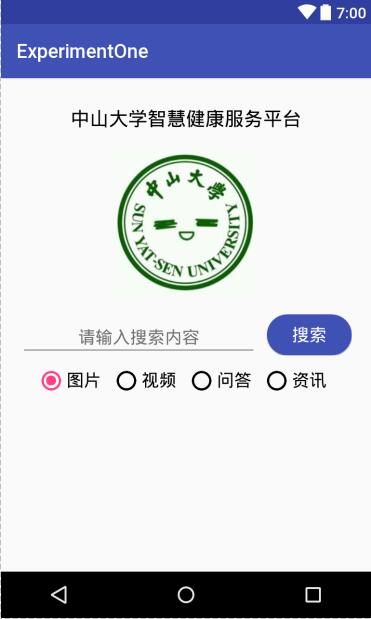
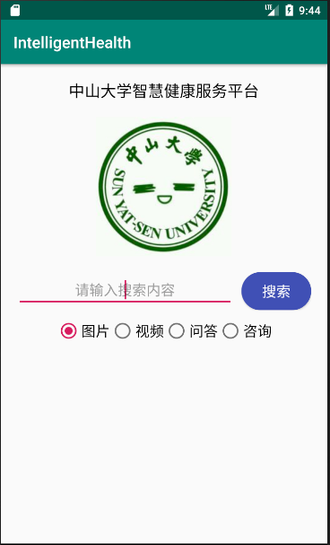

# 中山大学数据科学与计算机学院本科生实验报告

## （2018年秋季学期）

| 课程名称 | 手机平台应用开发 |   任课老师   |       郑贵锋        |
| :------: | :--------------: | :----------: | :-----------------: |
|   年级   |       16级       | 专业（方向） |   计算机应用软件    |
|   学号   |     16340157     |     姓名     |       刘亚辉        |
|   电话   |   15989067460    |    Email     | 15989067460@163.com |
| 开始日期 |    2018/10/2     |   完成日期   |      2018/10/2      |

------

## 一、实验题目

**基本的UI界面设计**

1. 熟悉Android Studio开发工具操作；
2. 熟悉Android Studio基本UI开发，并进行UI基本设计。

------

## 二、实现内容

实现一个Andriod应用，界面呈现如图中的效果。



**要求：**

- 该界面为应用启动后看到的第一个界面；
- 各控件的要求
  - 标题字体大小为**20sp**，与顶部距离**20dp**，居中；
  - 图片与上下控件的间距均为**20dp**，居中；
  - 输入框整体距左右屏幕各间距**20dp**，内容（包括提示内容）如图所示，内容字体大小**18sp**；
  - 按钮与输入框间距**10dp**，文字大小**18sp**。按钮背景框左右边框与文字间距**10dp**，上下边框与文字间距**5dp**，圆角半径**180dp**，背景色为**#3F51B5**；
  - 四个单选按钮整体居中，与输入框间距10dp，字体大小**18sp**，各个单选按钮之间间距**10dp**，默认选中的按钮为第一个。

**使用的组件：**

TextView、EditText、RelativeLayout、Button、ImageView、RadioGroup、RadioButton。

------

## 三、实验过程

### (1)实验截图



### (2)实验步骤以及关键代码

- 设置“中山大学智慧健康服务平台”标题：

```xml
<TextView
    android:id="@+id/title"
    android:layout_width="wrap_content"
    android:layout_height="wrap_content"
    android:layout_marginTop="20dp"
    android:text="中山大学智慧健康服务平台"
    android:textSize="20sp"
    android:textColor="#000"
    app:layout_constraintLeft_toLeftOf="parent"
    app:layout_constraintRight_toRightOf="parent"
    app:layout_constraintTop_toTopOf="parent" />
```

其中：`layout_constraintLeft_toLeftOf`表示此控件的左边框与某个控件的左边框对齐（若设置了margin等属性，则可能没有对齐）；`layout_constraintRight_toRightOf`和`layout_constraintTop_toTopOf`与此类似。同时设定`layout_constraintLeft_toLeftOf="parent" `和`layout_constraintRight_toRightOf="parent"`使得此空间相对于`parent`居中。

另外，居中也可以这样设置：

```xml
android: layout_width="match_parent"	// 设置宽度与父元素等宽
android: gravity="center_horizontal"	// 相对于父元素水平居中
```

常用属性值margin、padding设置：

`android:layout_margin(Left、Top、Right、Bottom):` 指定控件的四周的外部留出一定的边距

`android:padding（Left、Top、Right、Bottom）:`指定控件的四周的内部留出一定的边距

- 设置图片：

```xml
<ImageView
    android:id="@+id/sysu"
    android:layout_width="175dp"
    android:layout_height="175dp"
    android:scaleType="fitCenter"
    android:layout_marginTop="20dp"
    app:layout_constraintTop_toBottomOf="@+id/title"
    app:layout_constraintLeft_toLeftOf="parent"
    app:layout_constraintRight_toRightOf="parent"
    android:src="@mipmap/sysu" />
```

其中：`scaleType`属性值有`matrix`、`fitXY`、`fitStart`、`fitEnd`、`fitCenter`、`center`、`centerInside`、`centerCrop`。

1. `android: scaleType="matrix"`:

   不改变原图的大小，从ImageView的左上角开始绘制，超出部分做剪切处理。 

2. `android: scaleType="fitXY"`:

   把图片按照指定的大小在ImageView中显示，拉伸显示图片，不保持原比例，填满ImageView.

3. `android: scaleType="fitStart"`

   把原图按照比例放大缩小到ImageView的高度，显示在ImageView的start（前部/上部）。

4. `android: scaleType="fitEnd"`

   把原图按照比例放大缩小到ImageView的高度，显示在ImageVIew的end（后部/尾部/底部）

5. `android: scaleType="fitCenter"`

   把原图按照比例放大缩小到ImageView的高度，显示在ImageView的center（中部/居中显示）。 

6. `android: scaleType="center"`

   保持原图的大小，显示在ImageView的中心。当原图的size大于ImageView的size时，多出来的部分被截掉。 

7. `android: scaleType="centerInside"`

   以原图正常显示为目的，如果原图大小大于ImageView的size，就按照比例缩小原图的宽高，居中显示在ImageView中。如果原图size小于ImageView的size，则不做处理居中显示图片。 

8. `android: scaleType="centerCrop"`

   以原图填满ImageView为目的，如果原图size大于ImageView的size，则与center_inside一样，按比例缩小，居中显示在ImageView上。如果原图size小于ImageView的size，则按比例拉升原图的宽和高，填充ImageView居中显示。


- 设置搜索框：

```xml
<RelativeLayout
    android:id="@+id/search"
    android:layout_width="match_parent"
    android:layout_height="wrap_content"
    android:layout_marginTop="20dp"
    android:layout_marginLeft="20dp"
    android:layout_marginRight="20dp"
    app:layout_constraintTop_toBottomOf="@+id/sysu"
    app:layout_constraintStart_toStartOf="parent"
    app:layout_constraintEnd_toEndOf="parent">

    <EditText
        android:id="@+id/searchBox"
        android:layout_width="match_parent"
        android:layout_height="wrap_content"
        android:layout_toLeftOf="@+id/searchBtn"
        android:layout_marginRight="10dp"
        android:gravity="center"
        android:textSize="18sp"
        android:hint="请输入搜索内容"/>
    <Button
        android:id="@+id/searchBtn"
        android:layout_width="wrap_content"
        android:layout_height="wrap_content"
        android:background="@drawable/search_btn"
        android:text="搜索"
        android:textColor="#FFFFFF"
        android:textSize="18sp"
        android:layout_alignParentRight="true"/>
</RelativeLayout>
```

自定义style，给Button的background定义样式：

```xml
// 在文件夹src/res/drawable下创建文件search_btn.xml(注意：此文件名不能存在大写字符)
<?xml version="1.0" encoding="utf-8"?>
<shape xmlns:android="http://schemas.android.com/apk/res/android">
    <solid android:color="#3F51B5"/>
    <corners android:radius="180dp"/>
    <padding
        android:bottom="5dp"
        android:top="5dp"
        android:left="10dp"
        android:right="10dp"/>
</shape>
```

`RelativeLayout`相对布局介绍：

**设置布局里面组件的对其方式：**

`android: gravity:`设置容器内各个子组件的对齐方式

`android: ignoreGravity:`如果组件设置了这个属性的话,那么该组件不受gravity属性的影响

**根据父容器来定位：**

属性值为`true`、`false`

左\右对齐：`android:layout_alighParentLeft(Right)`

顶端\底部对齐：`android:layout_alighParentTop(Bottom)`

水平\垂直居中：`android:layout_centerHorizontal(Vertical)`

中央位置：`android:layout_centerInParent`

**根据兄弟组件来定位：**

属性值为兄弟组件的id

左\右边：`android:layout_toLeft(Right)Of`

上\下方：`android:layout_above(below)`

对齐上\下\左\右边界：`android:layout_alignTop(Bottom\Left\Right)`


- 设置单选按钮组：

```xml
<RadioGroup
    android:id="@+id/radioBtns"
    android:layout_marginTop="10dp"
    android:layout_height="wrap_content"
    android:layout_width="match_parent"
    app:layout_constraintTop_toBottomOf="@+id/search"
    android:orientation="horizontal"
    android:gravity="center_horizontal">
    <RadioButton
        android:id="@+id/radioBtn1"
        android:layout_width="wrap_content"
        android:layout_height="wrap_content"
        android:checked="true"
        android:text="图片"
        android:textSize="18sp"/>
    ...
    ...
    ...
</RadioGroup>
```

`RadioGroup`属性`android: orientation="horizontal"`表示在按钮组横向展开；`android：gravity="center_horizontal"`表示水平居中。`RadioButton`属性`android:checked="true"`表示该按钮为默认选择项。

### (3)实验遇到的困难以及解决思路

在相对布局中实现EditText自动填充（自适应宽度）：

> EditText的宽度应该为parentWidth-ButtonWidth-20dp\*2-10dp
> 所以EditText的宽度不是固定值，在UWP中，我们可以使用width="\*"的方法来定义宽度，但这里并不支持
> 所以采用另外一种实现方法：
> 首先：将Button放置在父元素（RelativeLayout）的最右侧
> 然后：给EditText设置属性：android: layout_toLeftOf="Button",并设定宽度为match_parent即可

另外，也可以使用`LinearLayout`来设置子组件的`Layout_weight`属性来实现此目的。

------

## 四、实验思考及感想

这次实验中学习了全新的内容，接触到了一个新的领域，手机应用开发。但是，任何应用的开发基本上都是类似的，UWP，WEB的设计也与之类似，都是通过某种语言（XAML，HTML/CSS）来完成页面的布局，所以属性设计之间都是相通的。在学习的过程中应该能够触类旁通，多接触一些全新的内容，扩展自己的知识面以及思维方式。当遇到解决不了的问题是，可以考虑换一种模型，换一种思路，也许该问题就会迎刃而解。

------

