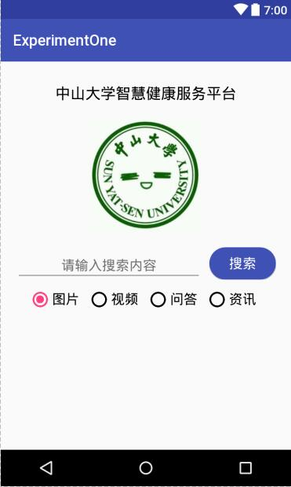
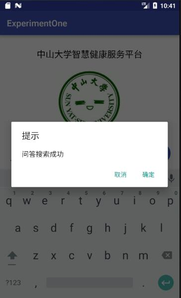

# 中山大学数据科学与计算机学院本科生实验报告

## （2018年秋季学期）

| 课程名称 | 手机平台应用开发 |   任课老师   |       郑贵锋        |
| :------: | :--------------: | :----------: | :-----------------: |
|   年级   |       16级       | 专业（方向） |   计算机应用软件    |
|   学号   |     16340157     |     姓名     |       刘亚辉        |
|   电话   |   15989067460    |    Email     | 15989067460@163.com |
| 开始日期 |    2018/10/3     |   完成日期   |      2018/10/3      |

------

## 一、实验题目

**基础的事件处理：**

1. 了解Android编程基础；
2. 熟悉Button、RadioButton、EdirText等基本控件，能够处理这些控件的基本事件；
3. 学会弹出对话框，并定制对话框中的内容，能对确定和取消按钮的事件做处理。

------

## 二、实现内容

实现Android应用，界面呈现如下：



**要求：**

- 该界面为应用启动后看到的第一个界面。

- 各控件处理的要求

  - 点击搜索按钮：
    - 如果搜索内容为空，弹出Toast信息“**搜索内容不能为空**”。

    - 如果搜索内容为“Health”，根据选中的RadioButton项弹出如下对话框。

      

      点击“确定”，弹出Toast信息——**对话框“确定”按钮被点击**。
      点击“取消”，弹出Toast 信息——**对话框“取消”按钮被点击**。
      否则弹出如下对话框，对话框点击效果同上。

  - RadioButton选择项切换：选择项切换之后，弹出Toast信息“**XX被选中**”，例如从图片切换到视频，弹出Toast信息“**视频被选中**”。

------

## 三、实验过程

### (1)实验截图

- 搜索内容为空：


- 成功搜索”Health“：


- 点击确定：

  

- 点击取消：

  

- 搜索失败：

  

- 改变单选按钮：

  

### (2)实验步骤以及关键代码

- 绑定监听函数

```java
@Override
protected void onCreate(Bundle savedInstanceState) {
    super.onCreate(savedInstanceState);
    setContentView(R.layout.activity_main);
    // 搜索框
    searchBtn = findViewById(R.id.searchBtn);
    searchBtn.setOnClickListener(new SearchBtnListener());
    // 单选按钮
    radioGroup = findViewById(R.id.radioBtns);
    radioGroup.setOnCheckedChangeListener(new CheckedChangeListener());
    // 输入框
    editText = findViewById(R.id.searchBox);
}
```

- 采用内部类的实现方式，实现**SearchBtnListener**和**CheckedChangeListener**监听类：

```java
class SearchBtnListener implements View.OnClickListener {
    @Override
    public void onClick(View v){
		// 重载onClick函数
    }
}

class CheckedChangeListener implements RadioGroup.OnCheckedChangeListener {
    @Override
    public void onCheckedChanged(RadioGroup group, int checkedId) {
		// 重载onCheckedChanged函数
    }
}
```

- 分别实现监听函数：

```java
// SearchBtnListener类onClick函数
public void onClick(View v){
    // 判断搜索内容是否为空
    String context = editText.getText().toString();
    if(TextUtils.isEmpty(context)) {
        // 创建Toast
        Toast.makeText(MainActivity.this, "搜索内容不能为空", Toast.LENGTH_SHORT).show();
    } else {
        // 创建Dialog
        final AlertDialog.Builder alertDialog = new AlertDialog.Builder(MainActivity.this);
        String message = new String();
        // 获取checkedBtn
        RadioButton checkedBtn = findViewById(radioGroup.getCheckedRadioButtonId());
        message = context.equals("Health") ? checkedBtn.getText()+"搜索成功" : "搜索失败";
        // Dialog的setTitle和setMessage等方法返回的都是Dialog对象，可以采用链式调用
        alertDialog.setTitle("提示").setMessage(message).setPositiveButton("确认", new DialogInterface.OnClickListener() {
            @Override
            public void onClick(DialogInterface dialog, int which) {
                Toast.makeText(getApplicationContext(),"对话框\"确认\"按钮被点击",Toast.LENGTH_SHORT).show();
            }
        }).setNegativeButton("取消", new DialogInterface.OnClickListener() {
            @Override
            public void onClick(DialogInterface dialog, int which) {
                Toast.makeText(getApplicationContext(),"对话框\"取消\"按钮被点击",Toast.LENGTH_SHORT).show();
            }
        });
        // 弹出Dialog
        alertDialog.show();
    }
}
```

```java
// CheckedChangeListener类onCheckedChanged函数
public void onCheckedChanged(RadioGroup group, int checkedId) {
    RadioButton checkedBtn = findViewById(checkedId);
    Toast.makeText(MainActivity. this,checkedBtn.getText()+"被选中", Toast.LENGTH_SHORT).show();
}
```

### (3)实验遇到的困难以及解决思路

常用的监听事件：

- **ListView **事件监听：**setOnItemSelectedListener:**鼠标滚动时触发，**setOnItemClickListener:**点击时触发 
- **EditText **事件监听：**setOnKeyListener: **获取焦点时触发 
- **RadioGroup **事件监听：**setOnCheckedChangeListener:**点击时触发 
- **CheckBox **事件监听：**setOnCheckedChangeListener:**点击时触发 
- **Spinner** 事件监听：**setOnltemSelectedListener:**点击时触发
- **DatePicker** 事件监听：**onDateChangedListener:**日期改变时触发
- **DatePickerDialog** 事件监听：**onDateSetListener:**设置日期时触发 
- **TimePicker** 事件监听：**onTimeChangedListener:**时间改变时触发 
- **TimePickerDialog** 事件监听：**onTimeSetListener:** 设置时间时触发 
- **Button.ImageButton** 事件监听：**setOnClickListener:** 点击时触发 
- **Menu** 事件监听：**onOptionsltemSelected;** 点击时触发 
- **Gallery** 事件监听：**setOnItemClickListener: **点击时触发 
- **GridView** 事件监听：**setOnltemClickListener: **点击时触发

实现事件监听器的方法：内部类形式、外部类形式、匿名内部类形式、直接绑定到标签(**onClick**属性等)。

**外部类形式：**

```java
// 将监听类的定制放在MainActivity外部
class SearchBtnListener implements View.OnClickListener {
    @Override
    public void onClick(View v){
		// 重载onClick函数
    }
}
```

**匿名内部类形式：**

```java
public class MainActivity extends AppCompatActivity {
    @Override
    protected void onCreate(Bundle savedInstanceState) {
        super.onCreate(savedInstanceState);
        setContentView(R.layout.activity_main);

        Button searchBtn = findViewById(R.id.searchBtn);
        searchBtn.setOnClickListener(new View.OnClickListener() {
            @Override
            public void onClick(View v) {
                //事件处理
            }
        });
    }
}
```

**直接绑定到标签：**

```xml
<!-- 给Button标签绑定属性onClick -->
<Button
	android: onClick="handleBtnClick"
	.../>
```

```java
// 定义handleBtnClick函数，参数为View类型
public class MainActivity extends AppCompatActivity {
    @Override
    protected void onCreate(Bundle savedInstanceState) {
        super.onCreate(savedInstanceState);
        setContentView(R.layout.activity_main);

        public void handleBtnClick(View v) {
            // ...
        }
    }
}
```

------

## 四、实验思考及感想

Android应用开发中的事件监听函数与Web、UWP、Cocos应用的事件监听函数类似：首先为控件注册监听函数，然后实现该监听函数即可。在学习的过程中，应该学会做到举一反三，不断思考，不断回顾，从而充实沉淀自己的所学。

------

