# 中山大学数据科学与计算机学院本科生实验报告

## （2018年秋季学期）

| 课程名称 | 手机平台应用开发 |   任课老师   |       郑贵锋        |
| :------: | :--------------: | :----------: | :-----------------: |
|   年级   |       16级       | 专业（方向） |   计算机应用软件    |
|   学号   |     16340157     |     姓名     |       刘亚辉        |
|   电话   |   15989067460    |    Email     | 15989067460@163.com |
| 开始日期 |     11月10日     |   完成日期   |      11月10日       |

------

## 一、实验题目

1. 学习SharedPreference的基本使用。  
2. 学习Android中常见的文件操作方法。
3. 复习Android界面编程。

------

## 二、实现内容

#### 要求  

- Figure 1：首次进入，呈现创建密码界面。  
  
- Figure 2：若密码不匹配，弹出Toast提示。  
   
- Figure 3：若密码为空，弹出Toast提示。  
  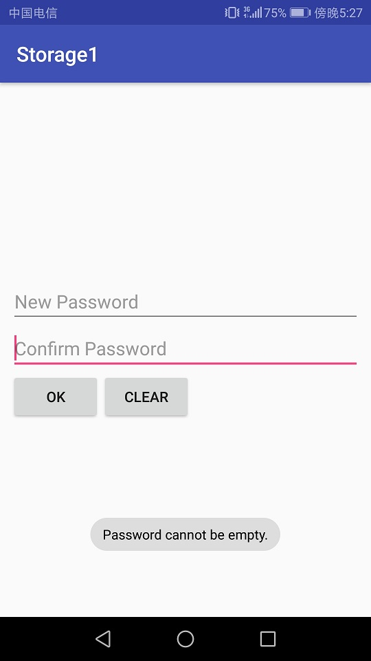 
- Figure 4：退出后第二次进入呈现输入密码界面。  
  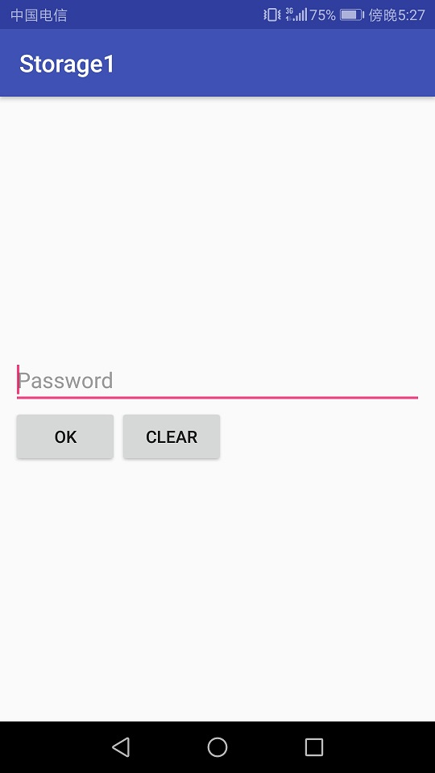 
- Figure 5：若密码不正确，弹出Toast提示。  
  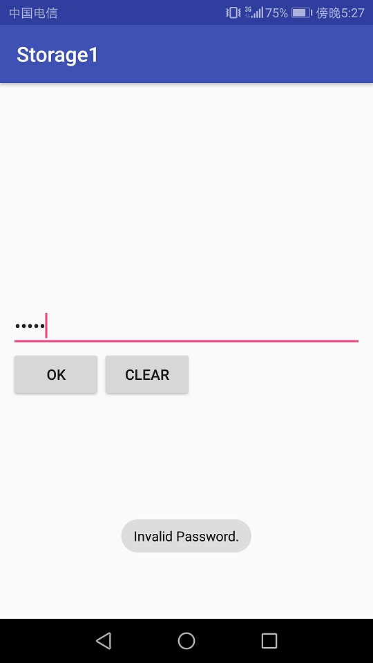
- Figure 6：文件加载失败，弹出Toast提示。  
   
- Figure 7：成功保存文件，弹出Toast提示。  
   
- Figure 8：成功导入文件，弹出Toast提示。  
   

1. 如Figure 1至Figure 8所示，本次实验演示应用包含两个Activity。 
2. 首先是密码输入Activity：
   - 若应用首次启动，则界面呈现出两个输入框，分别为新密码输入框和确认密码输入框。  
   - 输入框下方有两个按钮：  
     - OK按钮点击后：  
       - 若New Password为空，则发出Toast提示。见Figure 3。
       - 若New Password与Confirm Password不匹配，则发出Toast提示，见Figure 2。
       - 若两密码匹配，则保存此密码，并进入文件编辑Activity。
     - CLEAR按钮点击后：清楚两输入框的内容。  
   - 完成创建密码后，退出应用再进入应用，则只呈现一个密码输入框，见Figure 4。
     - 点击OK按钮后，若输入的密码与之前的密码不匹配，则弹出Toast提示，见Figure 5。
     - 点击CLEAR按钮后，清除密码输入框的内容。
   - **出于演示和学习的目的，本次实验我们使用SharedPreferences来保存密码。但实际应用中不会使用这种方式来存储敏感信息，而是采用更安全的机制。见[这里](http://stackoverflow.com/questions/1925486/android-storing-username-and-password)和[这里](http://stackoverflow.com/questions/785973/what-is-the-most-appropriate-way-to-store-user-settings-in-android-application/786588)。**
3. 文件编辑Activity：
   - 界面底部有三个按钮，高度一致，顶对齐，按钮水平均匀分布，三个按钮上方除ActionBar和StatusBar之外的全部空间由一个EditText占据（保留margin）。EditText内的文字竖直方向置顶，左对齐。
   - 在编辑区域输入任意内容，点击SAVE按钮后能保存到指定文件（文件名随意）。成功保存后，弹出Toast提示，见Figure 8。
   - 点击CLEAR按钮，能清空编辑区域的内容。
   - 点击LOAD按钮，能够从同一文件导入内容，并显示到编辑框中。若成功导入，则弹出Toast提示。见Figure 7.若读取文件过程中出现异常（如文件不存在），则弹出Toast提示。见Figure 6.
4. 特殊要求：进入文件编辑Activity后，若点击返回按钮，则直接返回Home界面，不再返回密码输入Activity。

------

### 验收内容

1. 布局显示与Figure 1 至 Figure 8一致。
2. 应用逻辑与上文描述一致。
   - 异常情况弹出Toast提示。
   - 创建密码后重新启动应用，直接显示单个输入框输入密码。
   - 文本编辑页面：能够正常保存和读取文件。
3. 在实验报告中简要描述Internal Storage和External Storage的区别，以及它们的适用场景。
4. 代码+实验报告（先在实验课上检查，检查后再pr）

------

## 三、实验结果

### (1)实验截图

- Figure 1：首次进入，呈现创建密码界面。

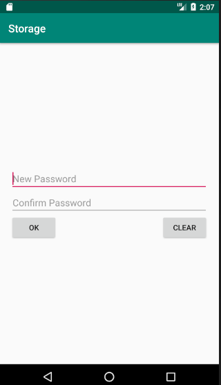

- Figure 2：若密码不匹配，弹出Toast提示。

  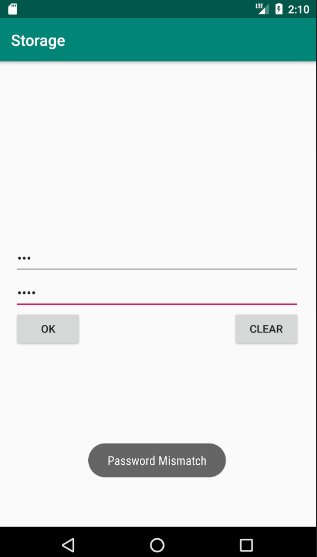

- Figure 3：若密码为空，弹出Toast提示。

  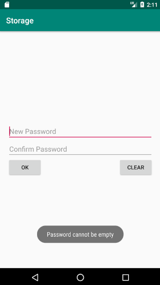

- Figure 4：退出后第二次进入呈现输入密码界面。

  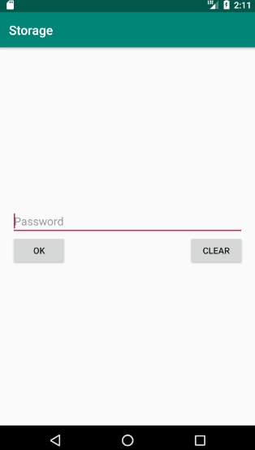

- Figure 5：若密码不正确，弹出Toast提示。

  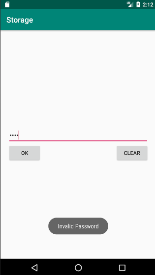

- Figure 6：文件加载失败，弹出Toast提示。

  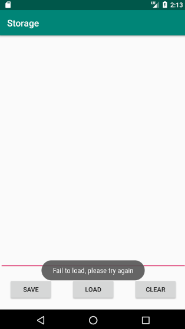

- Figure 7：成功保存文件，弹出Toast提示。

  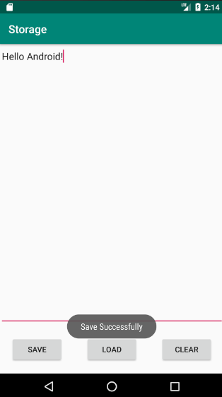

- Figure 8：成功导入文件，弹出Toast提示。

  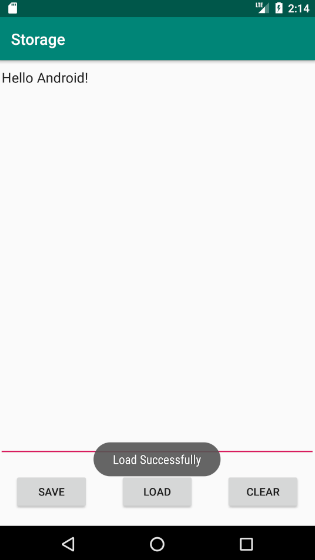

### (2)实验步骤以及关键代码

首先介绍Android的数据存取方式：

Android有4种数据存取的方式：

> SharedPrefrences 轻量级NVP（Name/Value Pair，名称/值对）方式存储，以 XML的文件方式保存； 
>
> 文件 采用java.io.*库提供的I/O接口读写文件；
>
> SQLite数据库轻量级嵌入式内置数据库； 
>
> ContentProvider 封装各种数据源（文件、数据库、网络），共享给多个应用。

### SharedPreferences：

应用场景：

- 保存播放位置：用手机播放器播放音乐，我们希望重启 播放器时，播放器能从上次停止的那首曲目开始播放
- 自动登录：记住登录用户名（密码）

什么是SharedPreferences？

- 一种轻量级的数据保存方式。
- 类似于我们常用的ini文件，用来保存应用程序的一些属 性设置、较简单的参数设置。
- 保存现场：保存用户所作的修改或者自定义参数设定， 当再次启动程序后回复上次退出时的状态。
- 将NVP（Name/Value Pair，名称/值对）保存在Android 的文件系统中（XML文件），完全屏蔽的对文件系统的 操作过程。 NVP举例: (姓名,张三), (性别,男), (年龄,30), …
- 开发人员仅是通过调用SharedPreferences的API对NVP 进行保存和读取。
- 除数据保存，还提供数据共享功能。
- 主要支持3种数据访问模式（读写权限） 
  - 私有（MODE_PRIVATE）：仅创建程序可读、写

使用方法：

- 第1步：定义访问模式 • 下面的代码将访问模式定义为私有模式

  ```java
  public static int MODE = MODE_PRIVATE
  ```

- 第2步：定义SharedPreferences的名称

  - 该名称与Android文件系统中保存的XML文件同名。
  - (保存在:/data/data/<package name>/shared_prefs/)
  - 相同名称的NVP内容，都会保存在同一个文件中。

  ```java
  public static final String PREFERENCE_NAME = "FileName";
  ```

- 第3步：创建SharedPreferences对象

  将访问模式和名称作为参数，传递到 getSharedPreferences()函数，并获得 SharedPreferences对象

  ```java
  SharedPreferences sharedPreferences = getSharedPreferences ( PREFERENCE_NAME, MODE );
  ```

- 第4步：修改与保存

  - 通过SharedPreferences.Editor类进行修改
  - 调用commit()函数保存修改内容 –支持数据类型：整型、布尔型、浮点型和长整型等

  ```java
  SharedPreferences.Editor editor = sharedPreferences.edit(); editor.putString("Name", "Tom"); 
  editor.putInt("Age", 20); 
  editor.putFloat("Height", (float)163.00 ); 
  editor.commit();
  ```

- 第5步：读取数据(可紧接第3步) 

  - 先调用getSharedPreferences()函数获得对象

  - 通过get<Type>()函数获取NVP

    第1个参数是NVP的名称(Name) 

    第2个参数是在无法获取到数值的时候使用的缺 省值 

  ```java
  SharedPreferences sharedPreferences = getSharedPreferences(PREFERENCE_NAME, MODE); String name = sharedPreferences.getString("Name","Default Name"); 
  int age = sharedPreferences.getInt("Age", 20);
  ```

### Android中的存储空间

Android 中的存储空间分为两种：Internal Storage 和 External Storage.

**Internal Storage**

- 默认情况下，保存在 Internal Storage 的⽂件只有应⽤程序可⻅，其他应⽤，以及⽤⼾本⾝是⽆法访问这些⽂件的。向 Internal Storage 写⼊⽂件的⽰例代码如下：  

```java
  try (FileOutputStream fileOutputStream = openFileOutput(FILE_NAME, MODE_PRIVATE)) { 
      String str = "Hello, World!";
      fileOutputStream.write(str.getBytes());
      Log.i("TAG", "Successfully saved file.");
  } catch (IOException ex) {
      Log.e("TAG", "Fail to save file.");
  }
```

  若对应的⽂件不存在，openFileOutput(String, int) 函数会直接新建⽂件。注意传⼊的⽂件名参数不能含有 path separators（即 '/'）. 该函数返回⼀个 FileOutputStream 对象，可以调⽤write() ⽅法写⼊内容。

- 相应地，⽂件的读取可以使⽤ openFileInput(String) 来读取⽂件。该函数返回⼀个 FileInputStream，调⽤read() ⽅法读取内容。  

```java
  try (FileInputStream fileInputStream = openFileInput(FILE_NAME)) {
      byte[] contents = new byte[fileInputStream.available()];
      fileInputStream.read(contents);
  } catch (IOException ex) {
      Log.e("TAG", "Fail to read file.");
  }
```

**External Storage**

Android ⽀持使⽤ Java 的⽂件 API 来读写⽂件，但是关键的点在于要有⼀个合适的路径。如果你要存储⼀些公开的，体积较⼤的⽂件（如媒体⽂件），External Storage 就是⼀个⽐较合适的地⽅。如⽂档中所说：

> All Android devices have two file storage areas: “internal” and “external”storage. These names come from the early days of Android, when most devicesoffered built-in non-volatile memory (internal storage), plus a removable storagemedium such as a micro SD card (external storage). Some devices dividethe permanent storage space into “internal” and “external” partitions, so evenwithout a removable storage medium, there are always two storage spaces and theAPI behavior is the same whether the external storage is removable or not.  

⽆论是否⽀持外置 SD 卡，所有的 Android 设备都会将存储空间分为 internal 和 external 两部分。

- 要往 External Storage 写⼊⽂件，需要在 AndroidManifest.xml ⽂件中声明权限：

```xml
<manifest ...>
    <uses-permission android:name="android.permission.WRITE_EXTERNAL_STORAGE" />
    ...
</manifest>
```

- 随后调⽤ getExternalFilesDir(String type) 或 Environment.getExternalStoragePublicDirectory()
  来获取 SD 卡路径。两者的区别在于：前者指向的⽬录会在应⽤卸载时被删除，⽽后者不会。
- 上⾯的两个函数均返回⼀个 File 对象，代表⼀个⽬录路径，使⽤这个 File 对象，再结合⽂件名，即
  可创建 FileInputStream 或 FileOutputStream 来进⾏⽂件读写。
- 举例：

```java
void createExternalStoragePrivateFile() {
    // Create a path where we will place our private file on external
    // storage.
    File file = new File(getExternalFilesDir(null), "DemoFile.jpg");

    try {
        // Very simple code to copy a picture from the application's
        // resource into the external file. Note that this code does
        // no error checking, and assumes the picture is small (does not
        // try to copy it in chunks). Note that if external storage is
        // not currently mounted this will silently fail.
        InputStream is = getResources().openRawResource(R.drawable.balloons);
        OutputStream os = new FileOutputStream(file);
        byte[] data = new byte[is.available()];
        is.read(data);
        os.write(data);
        is.close();
        os.close();
    } catch (IOException e) {
      // Unable to create file, likely because external storage is
      // not currently mounted.
      Log.w("ExternalStorage", "Error writing " + file, e);
  }
}
```

### MainActivity UI定义

```xml
    <LinearLayout
        android:layout_width="match_parent"
        android:layout_height="match_parent"
        android:padding="20dp"
        android:orientation="vertical"
        android:gravity="center_vertical">

        <EditText
            android:id="@+id/newPass"
            android:layout_width="match_parent"
            android:layout_height="wrap_content"
            android:hint="@string/new_password"
            android:inputType="textPassword"
            />

        <EditText
            android:id="@+id/confirmPass"
            android:layout_width="match_parent"
            android:layout_height="wrap_content"
            android:hint="@string/confirm_password"
            android:inputType="textPassword"
            />

        <EditText
            android:id="@+id/pass"
            android:layout_width="match_parent"
            android:layout_height="wrap_content"
            android:hint="@string/password"
            android:inputType="textPassword"
            android:visibility="gone"/>

        <RelativeLayout
            android:layout_width="match_parent"
            android:layout_height="wrap_content">

            <Button
                android:id="@+id/ok"
                android:layout_width="wrap_content"
                android:layout_height="wrap_content"
                android:text="@string/ok"
                android:layout_alignParentLeft="true"/>

            <Button
                android:id="@+id/clear"
                android:layout_width="wrap_content"
                android:layout_height="wrap_content"
                android:text="@string/clear"
                android:layout_alignParentRight="true"/>
        </RelativeLayout>
    </LinearLayout>
```

采用**LinearLayout**垂直排列密码框和按钮；其中创建密码框与登录密码框不同时出现，使用**visibility=“gone”**使得元素不可见并且不占用空间。

### MainActivity 事件处理

**okBtn、clearBtn完整点击事件处理如下：**

```java
// okBtn
okBtn = findViewById(R.id.ok);
okBtn.setOnClickListener(new OkBtnListener());
// 采用自定义类的形式注册监听事件
// OkBtnListener class
class OkBtnListener implements View.OnClickListener{
    @Override
    public void onClick(View v) {
        if(passText.getVisibility() == View.VISIBLE) {
            String password =  sharedPreferences.getString("Password", null);
            if(TextUtils.equals(passText.getText(), password)) {
                Toast.makeText(MainActivity.this, "Correct Password", Toast.LENGTH_SHORT).show();
                // 跳转到StorageActivity
                Intent intent = new Intent(MainActivity.this, StorageActivity.class);
                startActivity(intent);
            } else {
                Toast.makeText(MainActivity.this, "Invalid Password", Toast.LENGTH_SHORT).show();
            }
        } else {
            String newPass = newPassText.getText().toString();
            String confirmPass = confirmPassText.getText().toString();
            Log.i("newPass", newPass);
            Log.i("confirmPass", confirmPass);
            if(!TextUtils.equals(newPass, confirmPass)) {
                Toast.makeText(MainActivity.this, "Password Mismatch", Toast.LENGTH_SHORT).show();
            } else if (TextUtils.isEmpty(newPass) || TextUtils.isEmpty(confirmPass)){
                Toast.makeText(MainActivity.this, "Password cannot be empty", Toast.LENGTH_SHORT).show();
            } else {
                Toast.makeText(MainActivity.this, "Set password successfully", Toast.LENGTH_SHORT).show();
                // 保存密码
                SharedPreferences.Editor editor = sharedPreferences.edit();
                editor.putString("Password", newPass);
                editor.commit();

                newPassText.setVisibility(View.GONE);
                confirmPassText.setVisibility(View.GONE);
                passText.setVisibility(View.VISIBLE);
            }
        }
    }
}
// clearBtn
clearBtn = findViewById(R.id.clear);
clearBtn.setOnClickListener(new ClearBtnListener());

// ClearBtnListener class
class ClearBtnListener implements  View.OnClickListener{
    @Override
    public void onClick(View v) {
        newPassText.setText(null);
        confirmPassText.setText(null);
        passText.setText(null);
    }
}
```

**SharedPreferences：**

```java
Context context = null;
try {
    context = this.createPackageContext(PREFERENCE_PACKAGE, Context.CONTEXT_IGNORE_SECURITY);
} catch (PackageManager.NameNotFoundException e) {
    e.printStackTrace();
}

// sharedPreferences
sharedPreferences = context.getSharedPreferences(PREFERENCE_NAME, MODE);

// 此代码通过判断是否存储password来决定密码框的显示与否
if(!TextUtils.isEmpty(sharedPreferences.getString("Password", null))) {
    newPassText.setVisibility(View.GONE);
    confirmPassText.setVisibility(View.GONE);
    passText.setVisibility(View.VISIBLE);
}
```

### StorageActivity UI定义

```xml
<LinearLayout
        android:layout_width="match_parent"
        android:layout_height="match_parent"
        android:orientation="vertical">
    	<!-- 设置layout_weight="1" 使得EditText自适应剩余于高度 -->
        <EditText
            android:id="@+id/fileContent"
            android:layout_width="match_parent"
            android:layout_height="match_parent"
            android:inputType="textMultiLine"
            android:gravity="left|top"
            android:layout_weight="1"
            app:layout_constraintTop_toTopOf="parent"
            app:layout_constraintBottom_toTopOf="@+id/menu"/>

        <LinearLayout
            android:id="@+id/menu"
            android:layout_width="match_parent"
            android:layout_height="wrap_content"
            app:layout_constraintBottom_toBottomOf="parent">

            <Button
                android:id="@+id/save"
                android:layout_width="wrap_content"
                android:text="@string/save"
                android:layout_weight="1"
                android:layout_height="wrap_content"
                android:layout_margin="20dp"/>

            <Button
                android:id="@+id/load"
                android:layout_weight="1"
                android:text="@string/load"
                android:layout_width="wrap_content"
                android:layout_height="wrap_content"
                android:layout_margin="20dp"/>

            <Button
                android:id="@+id/storageClear"
                android:layout_weight="1"
                android:text="@string/clear"
                android:layout_width="wrap_content"
                android:layout_height="wrap_content"
                android:layout_margin="20dp"/>
        </LinearLayout>
    </LinearLayout>

```

### StorageActivity 事件处理

**saveBtn、loadBtn、clearBtn：**

```java
// saveBtn
saveBtn = findViewById(R.id.save);
saveBtn.setOnClickListener(new SaveBtnListener());

// loadBtn
loadBtn = findViewById(R.id.load);
loadBtn.setOnClickListener(new LoadBtnListener());

// clearBtn
storageClearBtn = findViewById(R.id.storageClear);
storageClearBtn.setOnClickListener(new ClearBtnListener());
```

**class SaveBtnListener：**

```java
class SaveBtnListener implements View.OnClickListener{
    @Override
    public void onClick(View v) {
        try (FileOutputStream fileOutputStream = openFileOutput("File.txt", MODE_PRIVATE)) {
            String str = fileContentText.getText().toString();
            fileOutputStream.write(str.getBytes());
            Log.i("TAG", "Successfully saved file.");
            Toast.makeText(StorageActivity.this, "Save Successfully", Toast.LENGTH_SHORT).show();
            fileOutputStream.flush();
        } catch (IOException ex) {
            Log.e("TAG", "Fail to save file.");
            Toast.makeText(StorageActivity.this, "Fail to save, please try again", Toast.LENGTH_SHORT).show();
        }
    }
}
```

**class LoadBtnListener：**

```java
class LoadBtnListener implements View.OnClickListener{
    @Override
    public void onClick(View v) {
        try (FileInputStream fileInputStream = openFileInput("File.txt")) {
            byte[] contents = new byte[fileInputStream.available()];
            fileInputStream.read(contents);
            Log.i("contents", new String(contents));
            fileContentText.setText(new String(contents));
            Toast.makeText(StorageActivity.this, "Load Successfully", Toast.LENGTH_SHORT).show();
        } catch (IOException ex) {
            Log.e("TAG", "Fail to read file.");
            Toast.makeText(StorageActivity.this, "Fail to load, please try again", Toast.LENGTH_SHORT).show();
        }
    }
}
```

**class ClearBtnListener：**

```java
class ClearBtnListener implements  View.OnClickListener{
    @Override
    public void onClick(View v) {
        fileContentText.setText(null);
    }
}
```

------

## 四、实验思考及感想

本地实验中主要接触到了Android开发中数据存储，我们可以使用SharedPreferences存储键值对的方式来存储一些简单的数据，SharedPreferences的使用也异常简单。另一方面，我们接触到了Android存储空间Internal Storage和External Storage，默认情况下，保存在 Internal Storage 的⽂件只有应⽤程序可⻅，其他应⽤，以及⽤⼾本⾝是⽆法访问这些⽂件的。如果你要存储⼀些公开的，体积较⼤的⽂件（如媒体⽂件），External Storage 就是⼀个⽐较合适的地⽅。所以，对于一些私密的比较小的文件可以使用Internal Storage来存储，而对于一些体积较大的访问不频繁的我们就可以使用External Storage来存储。这次实验中我也收获很多，多接下来数据持久化的灵活运用做铺垫。

------

