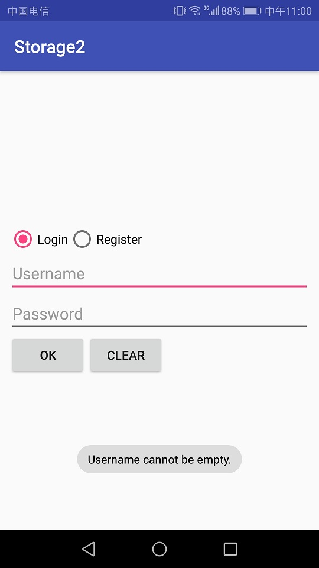
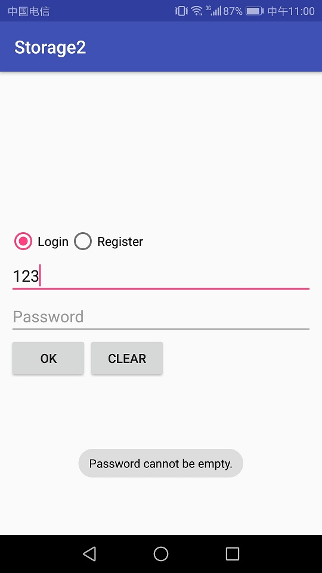
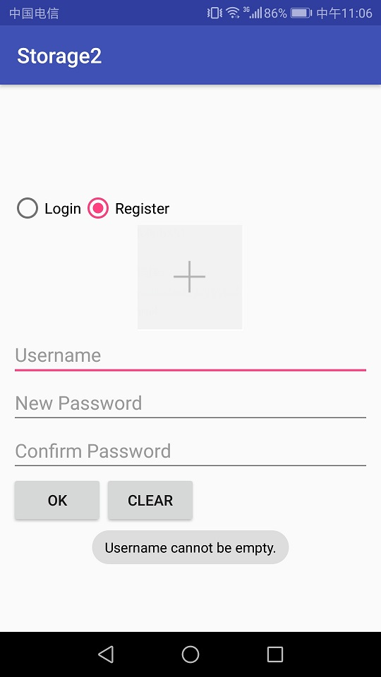
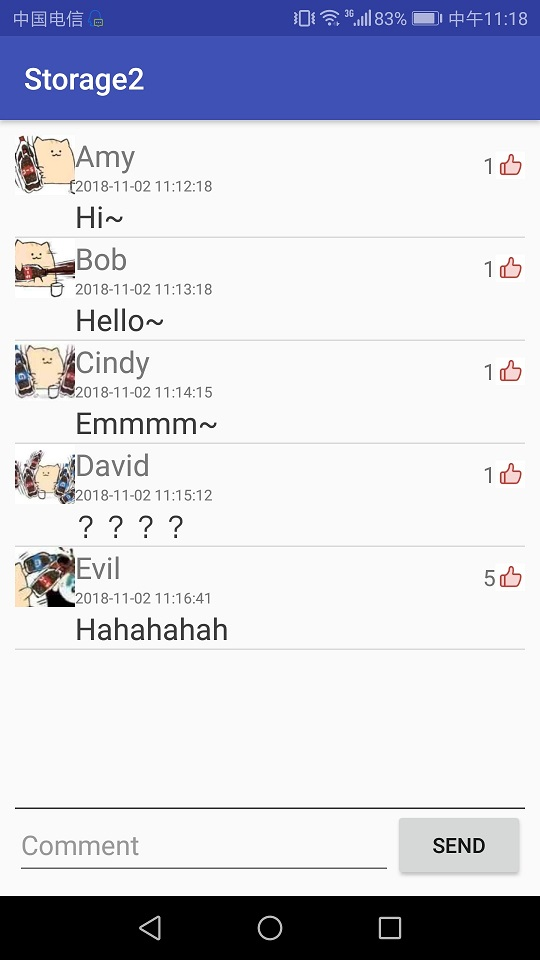
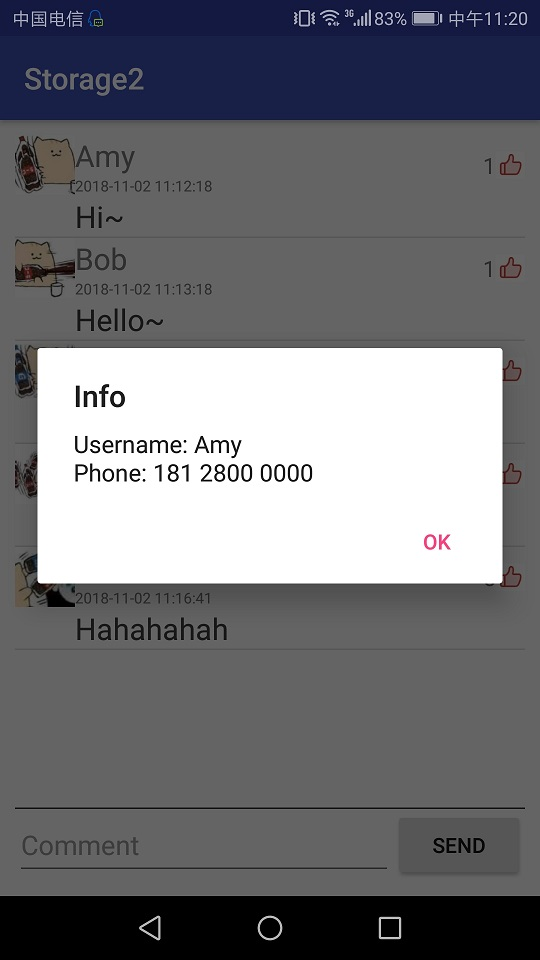
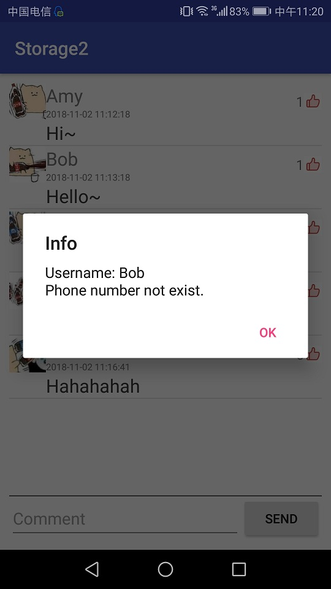
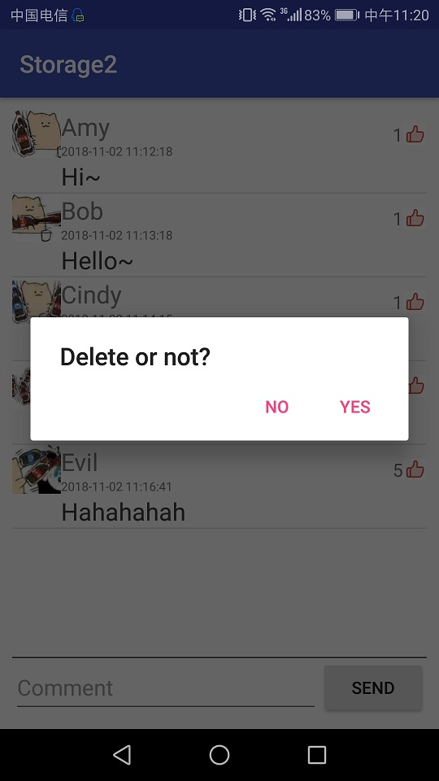
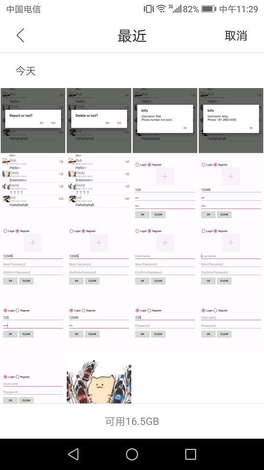

# 中山大学数据科学与计算机学院本科生实验报告

## （2018年秋季学期）

| 课程名称 | 手机平台应用开发 |   任课老师   |       郑贵锋        |
| :------: | :--------------: | :----------: | :-----------------: |
|   年级   |       16级       | 专业（方向） |   计算机应用软件    |
|   学号   |     16340157     |     姓名     |       刘亚辉        |
|   电话   |   15989067460    |    Email     | 15989067460@163.com |
| 开始日期 |     11月17日     |   完成日期   |      11月19日       |

------

[TOC]

<hr>

## 一、实验题目

**数据存储（二）**

1. 学习SQLite数据库的使用。  
2. 学习ContentProvider的使用。
3. 复习Android界面编程。

------

## 二、实现内容

### 实验内容

实现一个评论应用，本次实验虽然号称是（二），但是和（一）无法合并到同一个项目当中，因此本实验应当新建一个项目，而不是在（一）的基础上继续开发。

#### 实验要求  

<table>
    <tr>
        <td >点击Login切换到登录界面</td>
        <td >图1.2 若Username为空，则发出Toast提示</td>
    </tr>
    <tr>
        <td>图1.3 若Password为空，则发出Toast提示</td>
        <td >图1.4 若Username不存在，则发出Toast提示 </td>
    </tr>
    <tr>
        <td> 图1.5 若密码不正确，则发出Toast提示</td>
        <td></td>
    </tr>
    <tr>
        <td>图2.1 点击Register切换到注册页面</td>
        <td >图2.2 若Username为空，则发出Toast提示 </td>
    </tr>
    <tr>
        <td>图2.3 若New Password为空，则发出Toast提示</td>
        <td >图2.4 若New Password与Confirm Password不匹配，则发出Toast提示 </td>
    </tr>
    <tr>
        <td>图2.5 若Username已经存在，则发出Toast提示</td>
        <td > </td>
    </tr>  
    <tr>
        <td>图3.1 评论页面</td>
        <td >图3.2 若EditText为空，则发出Toast提示 </td>
    </tr>  
    <tr>
        <td>图3.3 短按评论：弹出对话框，显示该评论的用户以及通讯录中该用户的电话号码</td>
        <td >图3.4 短按评论：弹出对话框，显示该评论的用户以及通讯录中该用户的电话号码 </td>
    </tr>  
    <tr>
        <td>图3.5 弹出是否删除的对话框</td>
        <td >图3.6 弹出是否举报的对话框 </td>
    </tr>  
    <tr>
        <td>图4.1 进入手机图库进行图片选择</td>
        <td >图4.2 ImageView显示本次选择的图片 </td>
    </tr>  
    <tr>
        <td>图4.3 在评论页面，每条Item应当正确显示用户的头像</td>
        <td > </td>
    </tr>  
</table>

- #### 技术要求： 

  1. 使用SQLite数据库保存用户的相关信息和评论的相关信息，使得每次运行程序都可以使用数据库进行用户的登陆与注册，以及显示数据库中的评论；
  2. 使用ContentProvider来获取对应用户的电话号码；

- #### 功能要求：  

  1. 如图1至图8所示，本次实验演示应包含2个Activity。
  2. 首页Activity包含登录功能和注册功能，通过radioButton在两个页面进行切换,在登陆界面输入正确的用户名和密码后跳转到评论页面。
  3. 评论Activity,界面由ListView、EditText和Button组成，ListView中展示数据库中保存的评论信息，在EditText写评论，点击Send按钮发送评论。
  4. 首页Activity：
     - 应用启动时，界面初始化为登录界面，通过Login和Register两个RadioButton进行登录与注册之间的切换。
     - 点击Login切换到登录界面（见图1.1），可以保留注册界面时的Username，但不保存密码：
       - OK按钮点击后：
         - 若Username为空，则发出Toast提示。见图1.2.
         - 若Password为空，则发出Toast提示。见图1.3.
         - 若Username不存在，则发出Toast提示。见图1.4.
         - 若密码不正确，则发出Toast提示。见图1.5.
       - CLEAR按钮点击后：清除两个输入框的内容。
     - 点击Register切换到注册页面（见图2.1），可以保留登录界面时的Username，但不保存密码，在输入框和RadioButto之间存在一个头像ImageView，水平居中：
       - OK按钮点击后：
         - 若Username为空，则发出Toast提示。见图2.2.
         - 若New Password为空，则发出Toast提示。见图2.3.
         - 若New Password与Confirm Password不匹配，则发出Toast提示。见图2.4.
         - 若Username已经存在，则发出Toast提示。见图2.5. 
       - CLEAR按钮点击后：清除三个输入框的内容。
  5. 评论页面：
     - 界面底部有一个EditText和一个按钮，高度一致，EditText占据按钮左边的全部空间。上方的全部剩余空间由一个ListView占据（保留margin）。见图3.1.
     - ListView中的每条Item，包含了头像、点赞按钮这两个ImageView和用户名、评论时间、评论内容、点赞数这4个TextView。
       - 用户名、评论时间、评论内容在头像的右边。
       - 点赞按钮在Item的最右边，而且在用户名+评论时间的总高度上处于竖直方向上居中，**注意：总高度不包括评论占据的高度**
       - 点赞数在点赞按钮的左边，竖直方向居中要求同点赞按钮。
       - **以下样式供参考，不做强制要求，但要求至少美观：**
         - Item整体margin：10dp，
         - 头像width、hight：40sp，
         - 用户名textColor：#7a7a7a、textSize：20sp
         - 评论时间textColor：#7a7a7a、textSize：10sp
         - 评论textColor：#3e3e3e、textSize：20sp
         - 点赞数textSize：15sp 
     - 点击EditText写评论
     - 点击Send按钮发送评论
       - 若EditText为空，则发出Toast提示。如图3.2.
       - 若EditText不为空，则发送评论，在数据库和ListView中添加新评论。
     - ListView中的Item点击事件：
       - 短按评论：弹出对话框，显示该评论的用户以及通讯录中该用户的电话号码。如图3.3和图3.4.
       - 长按评论：
         - 若该评论为当前用户发送的，弹出是否删除的对话框,若选择了Yes，则删除该条评论并更新数据库和ListView。如图3.5.
         - 若该评论不为当前用户发送的，弹出是否举报的对话框，若选择了Yes，则弹出Toast提示，不需做任何数据库和ListView的更改。如图3.6.

  **附加内容（加分项，本次实验与（一）合计100分，加分项每项占10分）**

  1. **头像**
     在用户注册页面可以选择用户头像，ImageView初始化为图add，如图2.1。点击ImageView，进入手机图库进行图片选择。如图4.1.
     - 如果正确选择了一张图片，则ImageView显示本次选择的图片。如图4.2.
     - 如果没有正确选择图片（如在图片选择页面点击了取消或按了手机的BACK键），则ImageView保留本次点击事件发生前的状态，如初始的＋号图片，如图4.1，或者是上一个被正确选择的图像。如图4.2.
       在评论页面，每条Item应当正确显示用户的头像，如果用户没有在注册页面选择头像，则使用默认头像。如图4.3.
  2. **点赞**
     在评论界面，点赞按钮可以被点击，点赞数可以正常统计，用户点赞状态可以被正常记录，白色的未点赞状态经用户点击后变为红色的点赞状态，点赞数加1；再次点击点赞按钮可取消点赞，点赞数减1.要求用数据库记录点赞的信息，使得应用重启后用户的点赞状态，评论的点赞数可以正常显示，注意：用户的对每条评论的点赞状态是唯一的，即不同用户对每条评论的点赞状态应当分开记录，同一用户对不同评论的点赞状态也应当分开记录。同理，每条评论的点赞数也应当分开记录。请参考demo自行体会。

  **对附加内容的补充（不想做加分项的看这里）**

  1. **头像**
     在用户注册页面的ImageView显示为默认头像，且不需要添加任何的点击事件监听器，在评论页面的用户头像也使用默认头像。
  2. **点赞**
     不需要为点赞按钮添加点击事件监听器，关于点赞状态和点赞数使用随机数进行生成即可，也不要求用数据库记录点赞状态和点赞数。  
  3. **虽然点击事件的逻辑可以不做，但是界面的样式是必须按照前文做的！**

------

### 验收内容

1. 布局显示上文描述一致。
2. 应用逻辑与上文描述一致。
3. 在实验报告中写明本次实验的数据库中全部的表的信息，以及重要的SQL语句（如创建、查询、插入、删除等），对完成加分项的同学要额外写明如何用数据库存头像，如何设计评论与用户之间点赞关系的关联表。
4. 完成加分项“点赞”的同学在实验报告中写明如何实现的点击事件，以及点赞状态和点赞数是如何获取的。
5. 代码+实验报告（先在实验课上检查，检查后再pr）

------

## 三、实验结果

### (1)实验截图

<table>
    <tr>
        <td><br/>点击Login切换到登录界面</td>
        <td><br/>图1.2 若Username为空，则发出Toast提示</td>
    </tr>
    <tr>
        <td><br/>图1.3 若Password为空，则发出Toast提示</td>
        <td ><br/>图1.4 若Username不存在，则发出Toast提示 </td>
    </tr>
    <tr>
        <td><br/>图1.5 若密码不正确，则发出Toast提示</td>
        <td></td>
    </tr>
    <tr>
        <td><br/>图2.1 点击Register切换到注册页面</td>
        <td ><br/>图2.2 若Username为空，则发出Toast提示 </td>
    </tr>
    <tr>
        <td><br/>图2.3 若New Password为空，则发出Toast提示</td>
        <td ><br/>图2.4 若New Password与Confirm Password不匹配，则发出Toast提示 </td>
    </tr>
    <tr>
        <td><br/>图2.5 若Username已经存在，则发出Toast提示</td>
        <td > </td>
    </tr>  
    <tr>
        <td><br/>图3.1 评论页面</td>
        <td ><br/>图3.2 若EditText为空，则发出Toast提示 </td>
    </tr>  
    <tr>
        <td><br/>图3.3 短按评论：弹出对话框，显示该评论的用户以及通讯录中该用户的电话号码</td>
        <td ><br/>图3.4 短按评论：弹出对话框，显示该评论的用户以及通讯录中该用户的电话号码 </td>
    </tr>  
    <tr>
        <td><br/>图3.5 弹出是否删除的对话框</td>
        <td ><br/>图3.6 弹出是否举报的对话框 </td>
    </tr>  
    <tr>
        <td><br/>图4.1 进入手机图库进行图片选择</td>
        <td ><br/>图4.2 ImageView显示本次选择的图片 </td>
    </tr>  
    <tr>
        <td><br/>图4.3 在评论页面，每条Item应当正确显示用户的头像</td>
    </tr>
</table>
### (2)实验步骤以及关键代码

目录结构：

```bash
src
├─AndroidManifest.xml		# Android程序的全局配置文件，是每个android程序中必须的文件。它位于我们开发的应用程序的根目录下，描述了package中的全局数据，包括package中暴露的组件 （activities, services, 等等），以及他们各自的实现类，各种能被处理的数据和启动位置等重要信息。 
│
├─java
│  └─com
│      └─example
│          └─liuyh73
│              └─storage2
│                      Comment.java					# Comment数据结构
│                      CommentActivity.java			# 评论界面
│                      DBDAO.java					# 数据库数据访问对象
│                      MainActivity.java			# 登陆注册界面
│                      MyRecyclerViewAdapter.java	# 自定义适配器
│                      MyViewHolder.java			# 自定义viewholder
│                      OnItemClickListener.java		# 自定义元素点击接口
│                      User.java					# User数据结构
│
└─res
    ├─drawable
    │      border_top.xml							# 上边框
    │
    └─layout
           activity_comment.xml						# 评论界面
           activity_main.xml						# 主界面
           comment.xml								# 评论条目
```

#### Ⅰ、MainActivity设计与逻辑处理

##### ①、activity_main.xml

主界面中我们需要实现**登录**和**注册**功能，由于界面不一致，所以我们可以使用Android控件的**visibility**属性：当其值设置为**Gone**时该控件不显示，且不占用任何空间。

另外介绍控件的**layout_gravity**和**gravity**属性的区别：**layout_gravity**表示该控件自身布局显示效果；**gravity**表示控件内部子控件的显示效果。

```xml
    <!-- 下方代码省略大部分属性，只包括关键信息 -->
	<LinearLayout
        android:layout_width="match_parent"
        android:layout_height="match_parent"
        android:gravity="center_vertical"
        android:orientation="vertical"
        android:layout_margin="10dp">
        <RadioGroup
            android:id="@+id/radioGroup"
            android:orientation="horizontal">
            <RadioButton
                android:id="@+id/loginRadio"
                android:checked="true"/>
            <RadioButton
                android:id="@+id/registerRadio"/>
        </RadioGroup>

        <LinearLayout
            android:id="@+id/loginForm"
            android:orientation="vertical">
            <EditText
                android:id="@+id/loginFormUsername"/>
            <EditText
                android:id="@+id/loginFormPassword"/>
        </LinearLayout>

        <LinearLayout
            android:id="@+id/registerForm"
            android:orientation="vertical"
            android:visibility="gone">
            <ImageView
                android:id="@+id/registerFormImage"/>
            <EditText
                android:id="@+id/registerFormUsername"/>
            <EditText
                android:id="@+id/registerFormNewPass"/>
            <EditText
                android:id="@+id/registerFormConfirmPass"/>
        </LinearLayout>

        <RelativeLayout>
            <Button
                android:id="@+id/ok"/>
            <Button
                android:id="@+id/clear"/>
        </RelativeLayout>
    </LinearLayout>
```

##### ②、MainActivity.java

- 首先获取各个控件元素：

  在`onCreate`函数中获取所需的所有控件元素，其中`userDAO`为数据库访问对象，之后详细介绍。

  ```java
  protected void onCreate(Bundle savedInstanceState) {
      super.onCreate(savedInstanceState);
      setContentView(R.layout.activity_main);
      // radioGroup
      radioGroup = findViewById(R.id.radioGroup);
      radioGroup.setOnCheckedChangeListener(new RadioGroupCheckedChangeListener());

      // loginForm
      loginForm = findViewById(R.id.loginForm);
      // loginFormUsername
      loginFormUsername = findViewById(R.id.loginFormUsername);
      // loginFormNewPass
      loginFormPassword = findViewById(R.id.loginFormPassword);
      // registerForm
      registerForm = findViewById(R.id.registerForm);
      // registerFormImage
      registerFormImage = findViewById(R.id.registerFormImage);
      registerFormImage.setOnClickListener(new RegisterFormImageClickListener());
      // registerFormUsername
      registerFormUsername = findViewById(R.id.registerFormUsername);
      // registerFormNewPass
      registerFormNewPass = findViewById(R.id.registerFormNewPass);
      // registerFormConfirmPass
      registerFormConfirmPass = findViewById(R.id.registerFormConfirmPass);

      // okBtn
      okBtn = findViewById(R.id.ok);
      okBtn.setOnClickListener(new OkBtnListener());
      // clearBtn
      clearBtn = findViewById(R.id.clear);
      clearBtn.setOnClickListener(new ClearBtnListener());

      // dbDAO
      dbDAO = new DBDAO(MainActivity.this);
  }
  ```

- 定义**RadioGroup**的**CheckedChanged**监听事件：

  使用`onCheckedChanged`函数的第二个参数`index`与`R.id.loginRadio`或`R.id.registerRadio`比较即可得知`RadioGroup`所选择的按钮：

  ```java
  class RadioGroupCheckedChangeListener implements RadioGroup.OnCheckedChangeListener {
      @Override
      public void onCheckedChanged(RadioGroup radioGroup, int index) {
          if (index == R.id.loginRadio) {
              registerForm.setVisibility(View.GONE);
              loginForm.setVisibility(View.VISIBLE);
              loginFormUsername.setText(registerFormUsername.getText());
          } else {
              registerForm.setVisibility(View.VISIBLE);
              loginForm.setVisibility(View.GONE);
              registerFormUsername.setText(loginFormUsername.getText());
          }
      }
  }
  ```

- 定义**okBtn**的**Click**监听事件：

  实现自定义内部类，利用控件的`getVisibility`方法即可得知元素的可见属性，然后进行`login`或者`register`处理：

  ```java
  class OkBtnListener implements View.OnClickListener{
      @Override
      public void onClick(View v) {
          if(loginForm.getVisibility() == View.VISIBLE) {
              // 登录逻辑处理
              if (TextUtils.isEmpty(loginFormUsername.getText())) {
              	// Username is empty
                  Toast.makeText(MainActivity.this, "Username cannot be empty.", Toast.LENGTH_SHORT).show();
              } else if (TextUtils.isEmpty(loginFormPassword.getText())) {
                  // Password is empty
                  Toast.makeText(MainActivity.this, "Password cannot be empty.", Toast.LENGTH_SHORT).show();
              } else {
                  if (userDAO.get(loginFormUsername.getText().toString()) == null) {
                  	// 查询数据库判断用户不存在
                      Toast.makeText(MainActivity.this, "Username not exists.", Toast.LENGTH_SHORT).show();
                  } else {
                      User user = userDAO.get(loginFormUsername.getText().toString());
                      if (!user.getPassword().equals(loginFormPassword.getText().toString())) {
                          // 查询数据库判断用户、密码不匹配
                          Toast.makeText(MainActivity.this, "Invalid Password.", Toast.LENGTH_SHORT).show();
                      } else {
                          // 查询数据库判断用户、密码匹配
                          Toast.makeText(MainActivity.this, "Login successfully.", Toast.LENGTH_SHORT).show();
                          // 成功登录，跳转到commentActivity
                          Intent intent = new Intent(MainActivity.this, CommentActivity.class);
                          intent.putExtra("user", loginFormUsername.getText().toString());
                          clear();
                          startActivity(intent);
                      }
                  }
              }
          } else {
              // 注册逻辑处理
              if (TextUtils.isEmpty(registerFormUsername.getText())) {
                  // Username is empty
                  Toast.makeText(MainActivity.this, "Username cannot be empty.", Toast.LENGTH_SHORT).show();
              } else if (TextUtils.isEmpty(registerFormNewPass.getText())) {
                  // Newpass is empty
                  Toast.makeText(MainActivity.this, "Password cannot be empty.", Toast.LENGTH_SHORT).show();
              } else {
                  if(!registerFormNewPass.getText().toString().equals(registerFormConfirmPass.getText().toString())){
                      // !newPass.equals(confirmPass)
                      Toast.makeText(MainActivity.this, "Password Mismatch.", Toast.LENGTH_SHORT).show();
                  } else {
                      // newPass.equals(confirmPass)
                      User user = userDAO.get(registerFormUsername.getText().toString());
                      if(user != null) {
                          // 用户名已被注册
                          Toast.makeText(MainActivity.this, "Username already existed.", Toast.LENGTH_SHORT).show();
                      } else {
                          // 用户名未被注册
                          // 定义默认头像
                          if(portrait == null) {
                              portrait = BitmapFactory.decodeResource(MainActivity.this.getResources(), R.mipmap.me);
                          }
                          // 向数据库中插入新用户
                          userDAO.insert(new User(registerFormUsername.getText().toString(), registerFormNewPass.getText().toString(), portrait));
                          Toast.makeText(MainActivity.this, "Register successfully.", Toast.LENGTH_SHORT).show();
                          // 成功注册，默认登陆到commentActivity
                          Intent intent = new Intent(MainActivity.this, CommentActivity.class);
                          intent.putExtra("user", registerFormUsername.getText().toString());
                          clear();
                          startActivity(intent);
                      }
                  }
              }
          }
      }
  }
  ```

- 定义**clearBtn**的**Click**监听事件：

  ```java
  class ClearBtnListener implements View.OnClickListener{
      @Override
      public void onClick(View v) {
          loginFormUsername.setText(null);
          registerFormUsername.setText(null);
          clear(); //将密码框置空、头像选择为默认图片
      }
  }
  ```


##### ③、定义数据结构

用户属性包括username、password、portrait、comments(个人发表的评论列表)、thumbsUpComments(个人点赞的评论列表)；其中portrait使用Bitmap存储。各个属性的get和set方法未显示

```java
public class User {
    private String username;
    private String password;
    private Bitmap portrait;
    private List<Comment>comments;
    private List<Comment>thumbsUpComments;
}
```

#### Ⅱ、CommentActivity设计与逻辑处理

##### ①、activity_comment.xml

使用`LinearLayout`子控件的特有属性`layout_weight`来划分每个控件所占比例：将`RecyclerView`设置`layout_weight`为1即可，有关`RecyclerView`的配置不再赘述。

```xml
    <LinearLayout
        android:layout_width="match_parent"
        android:layout_height="match_parent"
        android:orientation="vertical">

        <android.support.v7.widget.RecyclerView
            android:id="@+id/recyclerView"
            android:layout_weight="1"
            android:layout_height="wrap_content"
            android:layout_width="match_parent"/>

        <LinearLayout
            android:paddingTop="5dp"
            android:layout_width="match_parent"
            android:layout_height="wrap_content"
            android:gravity="center_vertical"
            android:background="@drawable/border_top"
            app:layout_constraintBottom_toBottomOf="parent">

            <EditText
                android:id="@+id/comment"
                android:layout_width="wrap_content"
                android:layout_height="wrap_content"
                android:hint="@string/comment"
                android:layout_weight="1"/>

            <Button
                android:id="@+id/send"
                android:text="@string/send"
                android:layout_width="wrap_content"
                android:layout_height="wrap_content" />
        </LinearLayout>
    </LinearLayout>
```

其中UI最下方comment的上侧有黑色边框，我们可以通过设置background属性来实现，`drawable/border_top`文件实现如下：

```xml
<layer-list xmlns:android="http://schemas.android.com/apk/res/android">
    <!-- 连框颜色值 -->
    <item>
        <shape>
            <solid android:color="@color/colorBlack" />
        </shape>
    </item>
    <!-- 主体背景颜色值 -->
    <item android:top="1.5dp"><!--设置只有顶部有边框-->
        <shape>
            <solid android:color="@color/colorWhite" />
        </shape>
    </item>
</layer-list>
```

##### ②、comment.xml

此文件中实现的时`RecyclerView`子元素的样式，结构如下：


```xml
<LinearLayout xmlns:android="http://schemas.android.com/apk/res/android"
    android:layout_width="match_parent"
    android:layout_height="wrap_content"
    android:layout_margin="10dp"
    android:orientation="horizontal">
    <ImageView
        android:id="@+id/imageViewPortrait"
        android:layout_width="40sp"
        android:layout_height="40sp"
        android:layout_gravity="top"
        android:scaleType="centerCrop"
        android:src="@mipmap/me"
        android:layout_weight="0"/>
    <LinearLayout
        android:layout_width="match_parent"
        android:layout_height="wrap_content"
        android:orientation="vertical"
        android:layout_marginLeft="5dp"
        android:layout_marginRight="5dp"
        android:layout_weight="1">

        <LinearLayout
            android:layout_width="match_parent"
            android:layout_height="wrap_content"
            android:orientation="horizontal">
            <LinearLayout
                android:layout_width="match_parent"
                android:layout_height="wrap_content"
                android:layout_weight="1"
                android:orientation="vertical">
                <TextView
                    android:id="@+id/commentUsername"
                    android:layout_width="wrap_content"
                    android:layout_height="wrap_content"
                    android:textSize="20sp"
                    android:textColor="#7a7a7a"/>
                <TextView
                    android:id="@+id/commentTime"
                    android:layout_width="wrap_content"
                    android:layout_height="wrap_content"
                    android:textSize="10sp"
                    android:textColor="#7a7a7a"/>
            </LinearLayout>

            <RelativeLayout
                android:layout_width="wrap_content"
                android:layout_height="match_parent"
                android:layout_weight="0">
                <TextView
                    android:id="@+id/thumbsUpCount"
                    android:layout_width="wrap_content"
                    android:layout_height="match_parent"
                    android:textColor="@color/colorBlack"
                    android:gravity="center_vertical"
                    android:text="0"
                    android:textSize="15sp"/>
                <ImageView
                    android:id="@+id/thumbsUpImage"
                    android:layout_width="20sp"
                    android:layout_height="20sp"
                    android:layout_centerVertical="true"
                    android:focusable="false"
                    android:src="@mipmap/white"
                    android:layout_toRightOf="@+id/thumbsUpCount"/>
            </RelativeLayout>
        </LinearLayout>

        <TextView
            android:id="@+id/commentContent"
            android:layout_width="wrap_content"
            android:layout_height="wrap_content"
            android:textSize="20sp"
            android:textColor="#3e3e3e"/>
    </LinearLayout>
</LinearLayout>
```

##### ③、CommentActivity

###### 1、MyRecyclerViewAdapter

我们需要为RecyclerView实现自定义适配器，有关适配器的相关知识见前几节的内容：

```java
public abstract class MyRecyclerViewAdapter<Comment> extends RecyclerView.Adapter<MyViewHolder> {
    private Context context;
    private int layoutId;
    private List<Comment> commentList;
    private OnItemClickListener onItemClickListener;
    public MyRecyclerViewAdapter(Context _context, int _layoutId, List _commentList) {
        this.context = _context;
        this.layoutId = _layoutId;
        this.commentList = _commentList;
    }

    /**
     * 根据不同ViewType创建与之相应的Item-Layout
     */
    @Override
    public MyViewHolder onCreateViewHolder(ViewGroup parent, int viewType) {
        MyViewHolder holder = MyViewHolder.get(this.context, parent, this.layoutId);
        return holder;
    }

    /**
     * 访问数据集合并将数据绑定到正确的View上。
     */
    @Override
    public void onBindViewHolder(final MyViewHolder holder, int position) {
        convert(holder, this.commentList.get(position));

        if(onItemClickListener != null) {
            holder.itemView.setOnClickListener((new View.OnClickListener(){
                @Override
                public void onClick(View view) {
                onItemClickListener.onClick(holder.getAdapterPosition());
                }
            }));

            holder.itemView.setOnLongClickListener((new View.OnLongClickListener(){
                @Override
                public boolean onLongClick(View view) {
                    onItemClickListener.onLongClick(holder.getAdapterPosition());
                    return true;
                }
            }));
        }
    }

    public abstract void convert(MyViewHolder holder, Comment t);

    public void setOnItemClickListener(OnItemClickListener _onItemClickListener) {
        this.onItemClickListener = _onItemClickListener;
    }

    @Override
    public int getItemCount() {
        return commentList.size();
    }
}

```

###### 2、MyViewHolder

```java
/**
 * ViewHolder通常出现在适配器中，为的是listview，recyclerview滚动时快速设置值，
 * 而不必每次都重新创建很多对象，从而提升性能。
 */
public class MyViewHolder extends RecyclerView.ViewHolder {
    /**
     * views 存储listitem中的子View
     */
    private SparseArray<View> views;
    private View view;

    public MyViewHolder(Context _context, View _view, ViewGroup _viewGroup){
        super(_view);
        view = _view;
        views = new SparseArray<View>();
    }

    /**
     *  获取MyViewHolder实例
     */
    public static MyViewHolder get(Context _context, ViewGroup _viewGroup, int _layoutId) {
        View _view = LayoutInflater.from(_context).inflate(_layoutId, _viewGroup, false);
        MyViewHolder holder = new MyViewHolder(_context, _view, _viewGroup);
        return holder;
    }

    /**
     * ViewHolder尚未将子View缓存到SparseArray数组中时，仍然需要通过
     * findViewById()创建View对象，如果已缓存，直接返回即可。
     */
    public <T extends View> T getView(int _viewId) {
        View _view = views.get(_viewId);
        if (_view == null) {
            // 创建view
            _view = view.findViewById(_viewId);
            // 将view存入views
            views.put(_viewId, _view);
        }
        return (T)_view;
    }
}
```

###### 3. CommentActivity实现recyclerView

初始化MyRecyclerViewAdapter，下述方法极为重要：为每个comment的点赞图标设置了点击事件

```java
// initial MyRecyclerViewAdapter
recyclerViewAdapter = new MyRecyclerViewAdapter<Comment>(CommentActivity.this, R.layout.comment, this.commentList) {
    @Override
    public void convert(MyViewHolder holder, final Comment c) {
        // Comment，封装了数据信息，也可以直接将数据做成一个Map，那么这里就是Map<String, Object>
        // 此函数将comment的各种属性映射到相应的view的各种属性（即之前介绍的comment.xml）
        final TextView commentUsername = holder.getView(R.id.commentUsername);
        commentUsername.setText(c.getCommentUsername());

        final TextView commentTime = holder.getView(R.id.commentTime);
        commentTime.setText(c.getCommentTime());

        final TextView commentContent = holder.getView(R.id.commentContent);
        commentContent.setText(c.getCommentContent());

        final TextView thumbsUpCount = holder.getView(R.id.thumbsUpCount);
        thumbsUpCount.setText(String.valueOf(c.getThumbsUpCount()));
		
        // user表示发表我们点击的评论的用户
        final User user = dbDAO.get(c.getCommentUsername());
        // java中getComments()返回的列表为引用
        final List<Comment> userComments = user.getComments();
        ImageView imageViewPortrait = holder.getView(R.id.imageViewPortrait);
        imageViewPortrait.setImageBitmap(user.getPortrait());
        // 设置点赞的图标为red还是white
        final ImageView thumbsUpImage = holder.getView(R.id.thumbsUpImage);
        thumbsUpImage.setImageResource(R.mipmap.white);
        thumbsUpImage.setTag("white");
		// 如果当前登陆用户点赞列表中又该评论，则将该评论的点赞图标设置为red
        final List<Comment> loginUserThumbsUpComments = loginUser.getThumbsUpComments();
        for(Comment comment : loginUserThumbsUpComments){
            if(commentUsername.getText().toString().equals(comment.getCommentUsername()) && commentTime.getText().toString().equals(comment.getCommentTime())) {
                thumbsUpImage.setImageResource(R.mipmap.red);
                thumbsUpImage.setTag("red");
                break;
            }
        }
        // 定义点赞图标点击事件
        thumbsUpImage.setOnClickListener(new View.OnClickListener() {
            @Override
            public void onClick(View v) {
                if(thumbsUpImage.getTag() == "white"){
                    // 赞数增加1
                    thumbsUpImage.setTag("red");
                    thumbsUpImage.setImageResource(R.mipmap.red);
                    thumbsUpCount.setText(String.valueOf(Integer.parseInt(thumbsUpCount.getText().toString()) + 1));
                    c.setThumbsUpCount(Integer.parseInt(thumbsUpCount.getText().toString()));
                    loginUserThumbsUpComments.add(c);
                } else {
                    // 赞数减少1
                    thumbsUpImage.setTag("white");
                    thumbsUpImage.setImageResource(R.mipmap.white);
                    thumbsUpCount.setText(String.valueOf(Integer.parseInt(thumbsUpCount.getText().toString()) - 1));
                    c.setThumbsUpCount(Integer.parseInt(thumbsUpCount.getText().toString()));
                    loginUserThumbsUpComments.remove(c);
                }
                // 更新发表我们点击的评论的用户的comments列表的点赞数量
                for(Comment comment : userComments){
                    if(commentUsername.getText().toString().equals(comment.getCommentUsername()) && commentTime.getText().toString().equals(comment.getCommentTime())) {
                        comment.setThumbsUpCount(c.getThumbsUpCount());
                        break;
                    }
                }
                // 存储到数据库，更新当前用户的点赞情况
                dbDAO.updateThumbsUpComments(loginUser);
                // 存储到数据库，更新发表我们点击的评论的用户的comments列表的点赞数量
                dbDAO.updateComments(user);
            }
        });
    }
};
```

###### 4. 定义评论点击事件

```java
// 设定comment点击监听事件
recyclerViewAdapter.setOnItemClickListener(new OnItemClickListener() {
    // 短点击事件，访问通讯录获取相应用户的电话号码
    @Override
    public void onClick(int position) {
        Comment comment = commentList.get(position);
        Cursor cursor = getContentResolver().query(ContactsContract.CommonDataKinds.Phone.CONTENT_URI, null, ContactsContract.CommonDataKinds.Phone.DISPLAY_NAME+" = \"" + comment.getCommentUsername() + "\"", null, null);
        String phoneNumber = "\nPhone: ";
        if(cursor != null && cursor.getCount() > 0) {
            cursor.moveToFirst();
            do {
                phoneNumber += cursor.getString(cursor.getColumnIndex(ContactsContract.CommonDataKinds.Phone.NUMBER)) + "\n             ";
            }while (cursor.moveToNext());
        }

        if(phoneNumber.equals("\nPhone: ")) {
            phoneNumber = "\nPhone number not exists.";
        }
        final AlertDialog.Builder alertDialog = new AlertDialog.Builder(CommentActivity.this);
        alertDialog.setIcon(R.mipmap.ic_launcher).setTitle("Info").setMessage("Username: "+comment.getCommentUsername() + phoneNumber).setPositiveButton("OK", new DialogInterface.OnClickListener() {
            @Override
            public void onClick(DialogInterface dialog, int which) {
                return;
            }
        });
        alertDialog.show();
    }
    // 长点击事件
    @Override
    public void onLongClick(final int position) {
        final Comment comment = commentList.get(position);
        final AlertDialog.Builder alertDialog = new AlertDialog.Builder(CommentActivity.this);
        if(comment.getCommentUsername().equals(username)) {
            // 点击的评论为登陆用户所发表的，则可以进行删除操作
            alertDialog.setIcon(R.mipmap.ic_launcher).setTitle("Delete or not").setPositiveButton("YES", new DialogInterface.OnClickListener() {
                @Override
                public void onClick(DialogInterface dialog, int which) {
                    commentList.remove(position);
                    recyclerViewAdapter.notifyItemRemoved(position);
                    List<Comment> loginUserComments = loginUser.getComments();
                    loginUserComments.remove(comment);
                    dbDAO.updateComments(loginUser);
                }
            }).setNegativeButton("NO", new DialogInterface.OnClickListener() {
                @Override
                public void onClick(DialogInterface dialog, int which) {
                    return;
                }
            });
        } else {
            // 点击的评论部位当前用户所发表的，进行举报操作
            alertDialog.setIcon(R.mipmap.ic_launcher).setTitle("Report or not").setPositiveButton("YES", new DialogInterface.OnClickListener() {
                @Override
                public void onClick(DialogInterface dialog, int which) {
                    Toast.makeText(CommentActivity.this, "You have report the comment which " + comment.getCommentUsername()+" sent.", Toast.LENGTH_SHORT).show();
                }
            }).setNegativeButton("NO", new DialogInterface.OnClickListener() {
                @Override
                public void onClick(DialogInterface dialog, int which) {
                    return;
                }
            });
        }
        alertDialog.show();
    }
});
```

###### 5. 定义发表评论事件

```java
sendBtn.setOnClickListener(new View.OnClickListener(){
    @Override
    public void onClick(View v) {
        if(TextUtils.isEmpty(comment.getText())) {
            Toast.makeText(CommentActivity.this, "Comment cannot be empty.", Toast.LENGTH_SHORT).show();
        } else {
            // 定义新发表的评论
            Comment commentNew = new Comment(username, comment.getText().toString(), 0);
            // 加入到显示列表中
            commentList.add(commentNew);
            // 利用引用的特性，更新loginUserComments即可更新loginUser内部属性
            List<Comment> loginUserComments = loginUser.getComments();
            loginUserComments.add(commentNew);
            // 更新登陆用户的评论
            dbDAO.updateComments(loginUser);
            // 刷新recyclerView
            recyclerViewAdapter.notifyItemInserted(commentList.size()-1);
            comment.setText(null);
        }
    }
});
```

##### ④、定义数据结构Comment

Comment实现了Serializable接口，用于数据存储过程中的序列化。

```java
public class Comment implements Serializable {
    private String commentUsername;
    private String commentTime;
    private String commentContent;
    private int thumbsUpCount;
    private static final long serialVersionUID = 8711368828010083044L;
}
```

#### Ⅲ、数据存储

此次实验中的数据存储使用SQLite数据库：

- SQLite数据库具有很强的移植性，可以运行在Windows， Linux，BSD，Mac OS X和一些商用Unix系统，比如Sun 的Solaris，IBM的AIX
- SQLite数据库也可以工作在许多嵌入式操作系统下，例 如QNX，VxWorks，Palm OS，Symbian和Windows CE
- SQLite的核心大约有3万行标准C代码，模块化的设计使 这些代码更加易于理解

Android SDK包含了若干有用的SQLite数据库管理类，大多都存在于android.database.sqlite包中。SQLite基本数据类型有NULL、INTEGER（带符号的整数）、TEXT（文本字符串）、BLOB（二进制）、REAL（浮点值）

使用数据库的具体过程：

##### ①、创建实体类

在此次实验中，我以**User**作为实体类（前面有所介绍）。

##### ②、使用应用程序上下文创建SQLite数据库

- 首先创建的类需要继承SQLiteOpenHelper类

  ```java
  public class DBDAO extends SQLiteOpenHelper
  ```

- 然后定义数据库的名字、版本以及里面的TABLE的名字，定义SQL的创建表格命令：

  ```java
  private static final String DB_NAME = "users.db";
  private static final int DB_VERSION = 1;
  private static final String USER_TABLE_NAME = "user";
  
  private static final String SQL_CREATE_USER_TABLE = "create table " + USER_TABLE_NAME + " (username text primary key not null,"
      + " password text not null,"
      + " portrait blob not null,"
      + " comments blob,"
      + " thumbsUpComments blob)";
  ```

- 在onCreate函数中调用execSQL函数执行创建表格指令即可成功创建表格

  ```java
  // 第一次调用 getWritableDatabase() 或 getReadableDatabase() 时调用
  @Override
  public void onCreate(SQLiteDatabase db){
      // 创建数据库
      db.execSQL(SQL_CREATE_USER_TABLE);
  }
  ```

- 构造函数和onUpgrade函数如下：

  ```java
  public DBDAO(Context ctx) {
      /**
  	 * 创建数据库访问对象，实际没有创建数据库，马上返回。只有调用GetWriteableDatabase()或
  	 * getReadableDatabase() 时才会创建数据库。数据库文件位于/data/data/<package>/databases
       */
      super(ctx, DB_NAME, null, DB_VERSION);
  }
  
  /**
   * DB_VERSION变化时调用此函数
   */
  @Override
  public void onUpgrade(SQLiteDatabase db, int oldVersion, int newVersion){
     /**
      * 更新数据库版本（这里不使用）
      * db.execSQL("DROP TABLE IF EXISTS " + TABLE_NAME);
      * onCreate(db);
      */
  }
  ```

##### ③、实现数据库的增删改查操作

可以通过execsql函数直接执行SQL命令来完成数据操作，也可以通过 调用SQLiteDatabase类的公共函数insert()、delete()、update()和 query()这四个函数，封装了执行的添加、删除、更新和查询功能的 SQL命令；

在进行增删改查操作时，首先构造一个ContentValues对象，然后调用ContentValues对象的put()方 法，将每个属性的值写入到ContentValues对象中，最后使用 SQLiteDatabase对象的insert()函数，将ContentValues对象中的数据写入指 定的数据库表中。

```java
/* insert */
/* insert()函数的返回值是新数据插入的位置，即ID值。ContentValues类是一个数据承载容器，主要用来向数据库表中添加一条数据 */
public long insert(User user) {
    SQLiteDatabase db = getWritableDatabase();
    ContentValues contentValues = new ContentValues();
    // key/value
    contentValues.put("username", user.getUsername());
    contentValues.put("password", user.getPassword());
    contentValues.put("portrait", bitmapToBytes(user.getPortrait()));
    contentValues.put("comments", "");
    contentValues.put("thumbsUpComments", "");
    // 必须保证contentValues至少一个字段不为null，否则报错
    long rid = db.insert(USER_TABLE_NAME, null, contentValues);
    db.close();
    return rid;
}
```

```java
/* delete */
/**
 * delete()函数第1个参数是数据库表名，后面的参数是删除条件
 * 参数id指明了需要删除数据的id值，因此deleteById()函数仅删除一条数 据，此时delete()函数的返回值表示被删除的数据的数量；
 * 如果后面两个参数均为null，那么表示删除数据库中的全部数据。
 */
public int delete(User user) {
    SQLiteDatabase db = getWritableDatabase();
    String whereClause = "username = ?";
    String[] whereArgs = { user.getUsername() };
    int row = db.delete(USER_TABLE_NAME, whereClause, whereArgs);
    db.close();
    return row;
}
```

```java
/* updateComments */
public int updateComments(User user) {
    Log.i("updatePortrait", new String(bitmapToBytes(user.getPortrait())));
    SQLiteDatabase db = getWritableDatabase();
    String whereClause = "username = ?";
    String[] whereArgs = { user.getUsername() };
    ContentValues contentValues = new ContentValues();
    contentValues.put("comments", serializeComments(user.getComments()));
    int rows = db.update(USER_TABLE_NAME, contentValues, whereClause, whereArgs);
    db.close();
    return rows;
}

/* updateThumbsUpComments */
public int updateThumbsUpComments(User user) {
    SQLiteDatabase db = getWritableDatabase();
    String whereClause = "username = ?";
    String[] whereArgs = { user.getUsername() };
    ContentValues contentValues = new ContentValues();
    contentValues.put("thumbsUpComments", serializeComments(user.getThumbsUpComments()));
    int rows = db.update(USER_TABLE_NAME, contentValues, whereClause, whereArgs);
    db.close();
    return rows;
}
```

定义查询方法之前，先介绍一下Cursor类：在Android系统中，数据库查询结果的返回值并不是 数据集合的完整拷贝，而是返回数据集的指针，这个指针就是Cursor类。

Cursor类支持在查询的数据集合中多种方式移动，并能够获取数据集合的属性名称和序号，Cursor类方法说明如下： 

| 函数                  | 说明                                              |
| --------------------- | ------------------------------------------------- |
| moveToFirst           | 将指针移动到第一条数据上                          |
| moveToNext            | 将指针移动到下一条数据上                          |
| moveToPrevious        | 将指针移动到上一条数据上                          |
| getCount              | 获取集合的数据数量                                |
| getColumnIndexOrThrow | 返回指定属性名称的序号，如果属性不存在则 产生异常 |
| getColumnName         | 返回指定序号的属性名称                            |
| getColumnNames        | 返回属性名称的字符串数组                          |
| getColumnIndex        | 根据属性名称返回序号                              |
| moveToPosition        | 将指针移动到指定的数据上                          |
| getPosition           | 返回当前指针的位置                                |

SQLiteDatabase类的query()函数介绍：

```java
Cursor android.database.sqlite.SQLiteDatabase.query(String table, String[] columns, String selection, String[] selectionArgs, String groupBy, String having, String orderBy)
```

| 位置 | 类型+名称              | 说明                                                    |
| ---- | ---------------------- | ------------------------------------------------------- |
| 1    | String table           | 表名称                                                  |
| 2    | String[] columns       | 返回的属性列名称                                        |
| 3    | String selection       | 查询条件                                                |
| 4    | String[] selectionArgs | 如果在查询条件中使用的问号，则 需要定义替换符的具体内容 |
| 5    | String groupBy         | 分组方式                                                |
| 6    | String having          | 定义组的过滤器                                          |
| 7    | String orderBy         | 排序方式                                                |

```java
/* query all comments */
public List<Comment> getAllComments(){
    List<Comment>comments = new ArrayList<>();

    SQLiteDatabase db = getReadableDatabase();
    Cursor c = db.query(USER_TABLE_NAME, null, null, null, null,null, null);
    while (c.moveToNext()){
        comments.addAll(deserializeComments(c.getBlob(3)));
    }
    c.close();
    db.close();
    return comments;
}
/* query user */
public User get(String username){
    User user = null;
    SQLiteDatabase db = getReadableDatabase();
    String selection = "username = ?";
    String[] selectionArgs = { username };
    Cursor c = db.query(USER_TABLE_NAME, null, selection, selectionArgs, null,null, null);
    if (c.moveToNext()){
        user = new User(c.getString(0),c.getString(1), bytesToBitmap(c.getBlob(2)), deserializeComments(c.getBlob(3)), deserializeComments(c.getBlob(4)));
    }
    c.close();
    db.close();
    return user;
}
```

### (3)实验遇到的困难以及解决思路

#### Ⅰ、选择头像

[参考链接](https://blog.csdn.net/jdsjlzx/article/details/51181229)

定义选择头像的图片点击事件：

```java
class RegisterFormImageClickListener implements View.OnClickListener {
    @Override
    public void onClick(View v) {
        Intent intent = new Intent();
        intent.setAction(Intent.ACTION_PICK);	// action为Intent.ACTION_PICK
        intent.setType("image/*");				// 设置图片类型
        startActivityForResult(intent, 0);
    }
}
```

定义onActivityResult获取返回的图片数据：

```java
portrait = MediaStore.Images.Media.getBitmap(Activity.this.getContentResolver(), uri);
// 系统提供了上述获取图片的方法，其返回的是原始大小的bitmap，但是当图片过大时，会出现OOM的错误
```

下面进行改进：

```java
@Override
protected void onActivityResult(int requestCode, int resultCode, Intent data) {
    if (data != null) {
        // 首先获取图片地址
        Uri uri = data.getData();
        // 获取图片
        portrait = getBitmapFormUri(MainActivity.this, uri);
        registerFormImage.setImageBitmap(portrait);
    }
    super.onActivityResult(requestCode, resultCode, data);
}

public Bitmap getBitmapFormUri(Context ctx, Uri uri) throws FileNotFoundException, IOException {
    InputStream input = ctx.getContentResolver().openInputStream(uri);
    BitmapFactory.Options onlyBoundsOptions = new BitmapFactory.Options();
    onlyBoundsOptions.inJustDecodeBounds = true;
    onlyBoundsOptions.inDither = true;//optional
    onlyBoundsOptions.inPreferredConfig = Bitmap.Config.ARGB_8888;//optional
    BitmapFactory.decodeStream(input, null, onlyBoundsOptions);
    input.close();
    int originalWidth = onlyBoundsOptions.outWidth;
    int originalHeight = onlyBoundsOptions.outHeight;
    if ((originalWidth == -1) || (originalHeight == -1))
        return null;
    //图片分辨率以480x800为标准
    float hh = 400f;//这里设置高度为400f
    float ww = 400f;//这里设置宽度为400f
    //缩放比。由于是固定比例缩放，只用高或者宽其中一个数据进行计算即可
    int be = 1;//be=1表示不缩放
    if (originalWidth > originalHeight && originalWidth > ww) {//如果宽度大的话根据宽度固定大小缩放
        be = (int) (originalWidth / ww);
    } else if (originalWidth < originalHeight && originalHeight > hh) {//如果高度高的话根据宽度固定大小缩放
        be = (int) (originalHeight / hh);
    }
    if (be <= 0)
        be = 1;
    //比例压缩
    BitmapFactory.Options bitmapOptions = new BitmapFactory.Options();
    bitmapOptions.inSampleSize = be;//设置缩放比例
    bitmapOptions.inDither = true;//optional
    bitmapOptions.inPreferredConfig = Bitmap.Config.ARGB_8888;//optional
    input = ac.getContentResolver().openInputStream(uri);
    Bitmap bitmap = BitmapFactory.decodeStream(input, null, bitmapOptions);
    input.close();

    return compressImage(bitmap);//再进行质量压缩
}
```

质量压缩函数：

```java
public Bitmap compressImage(Bitmap image) {
    ByteArrayOutputStream baos = new ByteArrayOutputStream();
    image.compress(Bitmap.CompressFormat.JPEG, 100, baos);//质量压缩方法，这里100表示不压缩，把压缩后的数据存放到baos中
    int options = 100;
    while (baos.toByteArray().length / 1024 > 100) {  //循环判断如果压缩后图片是否大于100kb,大于继续压缩
        baos.reset();//重置baos即清空baos
        //第一个参数 ：图片格式 ，第二个参数： 图片质量，100为最高，0为最差  ，第三个参数：保存压缩后的数据的流
        image.compress(Bitmap.CompressFormat.JPEG, options, baos);//这里压缩options%，把压缩后的数据存放到baos中
        options -= 10;//每次都减少10
    }
    ByteArrayInputStream isBm = new ByteArrayInputStream(baos.toByteArray());//把压缩后的数据baos存放到ByteArrayInputStream中
    Bitmap bitmap = BitmapFactory.decodeStream(isBm, null, null);//把ByteArrayInputStream数据生成图片
    return bitmap;
}
```

#### Ⅱ、存取图片

数据库中存储图片格式为二进制，所以我们应该将Bitmap转化为二进制数据再进行存储：

```java
//图片转为二进制数据
public byte[] bitmapToBytes(Bitmap bitmap){
    int size = bitmap.getWidth() * bitmap.getHeight() * 4;
    //创建一个字节数组输出流,流的大小为size
    ByteArrayOutputStream baos= new ByteArrayOutputStream(size);
    try {
        //设置位图的压缩格式，质量为100%，并放入字节数组输出流中
        bitmap.compress(Bitmap.CompressFormat.PNG, 100, baos);
        //将字节数组输出流转化为字节数组byte[]
        byte[] imagedata = baos.toByteArray();
        return imagedata;
    }catch (Exception e){
    }finally {
        try {
            bitmap.recycle();
            baos.close();
        } catch (IOException e) {
            e.printStackTrace();
        }
    }
    return new byte[0];
}
```

从数据库读取二进制数据之后再生成图片：

```java
public Bitmap bytesToBitmap(byte[] bytes) {
    return BitmapFactory.decodeByteArray(bytes, 0, bytes.length);
}
```

#### Ⅲ、Comment序列化与反序列化

由于数据库中我定义了user表，每个用户发表的评论和点赞的评论作为了表格的一个属性，所以在将评论列表存储到数据库中是需要进行序列化。

注意下属函数中`ObjectOutputStream.writeObject`和`ObjectInputStream.readObject`、`ByteArrayInputStream`和`ByteArrayOutputStream`需要对应使用。另外不要使用`ByteArrayOutputStream`的`toString`方法，该方法获得的`String`变量调用`getBytes()`后作为`ByteArrayInputStream`反序列化不成功！

```java
// 序列化comments
public byte[] serializeComments(List<Comment> comments){
    ByteArrayOutputStream arrayOutputStream = new ByteArrayOutputStream();
    try {
        ObjectOutputStream objectOutputStream = new ObjectOutputStream(arrayOutputStream);
        // 直接将comments数组进行序列化
        objectOutputStream.writeObject(comments);
        objectOutputStream.writeObject(null);
        objectOutputStream.flush();
        byte[] data = arrayOutputStream.toByteArray();
        objectOutputStream.close();
        arrayOutputStream.close();
        return data;
    } catch (Exception e) {
        e.printStackTrace();
    }
    return new byte[]{};
}
```

```java
// 反序列化comments
public List<Comment> deserializeComments(byte[] commentsBytes) {
    try {
        ByteArrayInputStream arrayInputStream = new ByteArrayInputStream(commentsBytes);
        ObjectInputStream inputStream = new ObjectInputStream(arrayInputStream);
        List<Comment>comments = (ArrayList<Comment>) inputStream.readObject();
        inputStream.close();
        arrayInputStream.close();
        return comments;
    } catch (Exception e) {
        e.printStackTrace();
    }
    return new ArrayList<>();
}
```

#### Ⅳ、Content Provider使用

- ContentProvider（数据提供者）是在应用程序间共享数 据的一种接口机制
- 提供了更为高级的数据共享方法，应用程序可以指定需 要共享的数据，而其他应用程序则可以在不知数据来源、 路径的情况下，对共享数据进行查询、添加、删除和更新等操作
- 许多Android系统的内置数据通过ContentProvider提供 给用户使用，例如通讯录、音视频文件和图像文件等

使用方法如下：

- 在AndroidManifest.xml文件里声明读取通讯录的权限

```xml
<uses-permission android:name="android.permission.READ_CONTACTS"/>
```

- 使用getContentResolver方法查询相应用户名

```java
Cursor cursor = getContentResolver().query(ContactsContract.CommonDataKinds.Phone.CONTENT_URI, null, ContactsContract.CommonDataKinds.Phone.DISPLAY_NAME+" = \"" + comment.getCommentUsername() + "\"", null, null);
```

- 判断cursor不为空，且查询到至少一个号码

```java
if(cursor != null && cursor.getCount() > 0)
```

- 读取查询到的号码

```java
cursor.moveToFirst();
do {
    phoneNumber += cursor.getString(cursor.getColumnIndex(ContactsContract.CommonDataKinds.Phone.NUMBER)) + "\n             ";
}while (cursor.moveToNext());
```

#### Ⅴ、Comment类重载equals函数

在评论列表的更新过程中我们需要经常使用`ArrayList.remove(obj)`方法，此方法中就是调用对象的equals方法来进行判断。

> ```
> public boolean remove(Object o)
> ```
>
> Removes the first occurrence of the specified element from this list, if it is present. If the list does not contain the element, it is unchanged. More formally, removes the element with the lowest index `i` such that `(o==null ? get(i)==null : o.equals(get(i)))` (if such an element exists). Returns `true` if this list contained the specified element (or equivalently, if this list changed as a result of the call).

```java
// 此函数用于判断comment1.equals(comment2)
@Override
public boolean equals(Object obj){
    if(obj == null) {
        return false;
    }
    if(this == obj){
        return true;
    }
    if(obj instanceof Comment) {
        Comment comment = (Comment)obj;
        if(this.commentUsername.equals(comment.commentUsername) && this.commentTime.equals(comment.commentTime)){
            return true;
        } else {
            return false;
        }
    }
    return false;
}
```

------

## 四、实验思考及感想

在这次实验中，我们主要学习使用SQLite数据库来进行数据持久化操作，合理的设计数据库已经各个表格之间的关系有利于数据库的扩展已经数据的更删改查等操作。与上学期的UWP设计一样，我们都使用SQLite数据库，作为一个轻量级的软件库 ，它具有原子量性 、坚固性、独立性、耐久性，并且体积很小，十分便于用于App存储文件,并且SQLite支持大部分SQL语句便于我们进行数据库的相关操作。另一方面，我在这次的实验中学习了安卓应用对图库的访问以及图片的剪切；同时图片在数据库中的存储也进行了相关的学习。由于图片使用的Bitmap数据类型，所以我们就可以将其解析为二进制然后存储到数据库中，从数据库中读取出来时进行相应的转化即可。除此之外，我们还了解了ContentProvider已经如何进行数据分享。最后，由于我的存储模式，我需要对表格的某一属性存储一个ArrayList列表，所以这就需要进行序列化的相关操作。在应用功能实现过程中，我们不断接触新的内容，不断学习。

------

